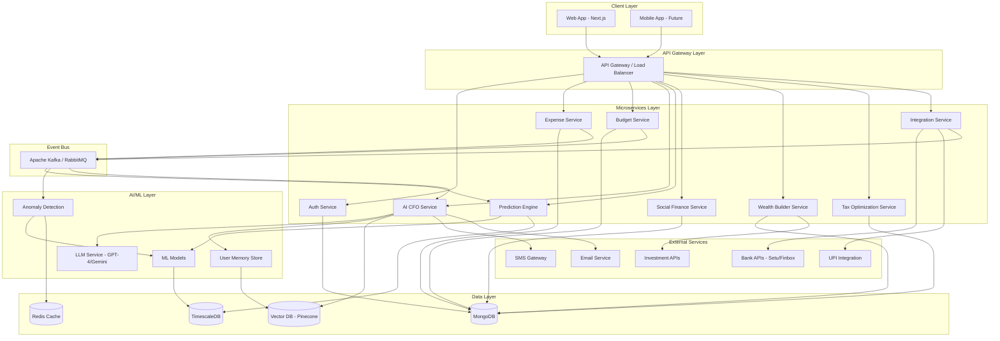
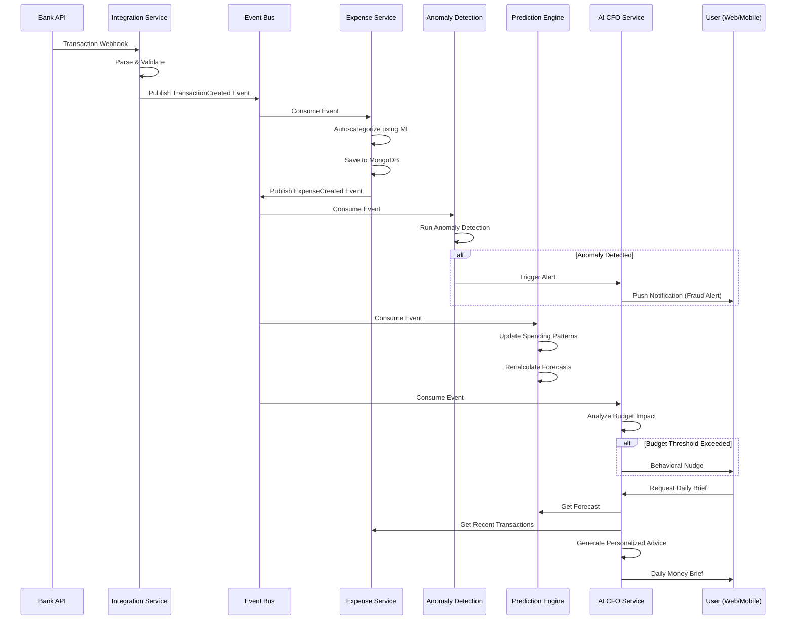

# Design Document: AI Financial Operating System

## Overview

Transform KharchaBuddy from a simple expense tracking tool into an intelligent AI Financial Operating System that acts as a personal CFO. This system will provide predictive analytics, autonomous decision-making, real-time financial advice, and automated wealth-building capabilities. The platform will leverage machine learning for expense prediction, anomaly detection, behavioral analysis, and personalized financial recommendations. It will integrate with banking APIs for real-time transaction ingestion, support conversational AI interactions, and provide comprehensive financial planning tools including tax optimization, scenario simulation, and automated investment strategies.

The system will be built on an event-driven microservices architecture with a real-time data pipeline, AI/ML layer with LLM integration and user memory, and seamless bank/payment integrations. The UX will transform into an AI-first interface combining chat and dashboard experiences with a premium fintech aesthetic.

## Architecture



## Main Workflow: Real-Time Transaction Processing




## Components and Interfaces

### Component 1: AI CFO Service

**Purpose**: Core conversational AI advisor providing personalized financial guidance, long-term planning, and real-time decision support

**Interface**:
```typescript
interface AIFinancialAdvisor {
  // Conversational interface
  chat(userId: string, message: string, context: ConversationContext): Promise<AIResponse>;
  
  // Daily briefing
  generateDailyBrief(userId: string): Promise<DailyBrief>;
  
  // Decision support
  shouldSpend(userId: string, amount: number, category: string): Promise<SpendingDecision>;
  
  // Long-term planning
  createFinancialPlan(userId: string, goals: FinancialGoal[]): Promise<FinancialPlan>;
  
  // Memory management
  updateUserMemory(userId: string, interaction: Interaction): Promise<void>;
  getUserMemory(userId: string): Promise<UserMemory>;
}

interface ConversationContext {
  conversationId: string;
  previousMessages: Message[];
  userProfile: UserProfile;
  currentFinancialState: FinancialSnapshot;
}

interface AIResponse {
  message: string;
  suggestions: Suggestion[];
  actions: Action[];
  confidence: number;
}

interface DailyBrief {
  summary: string;
  todaysBudget: number;
  upcomingBills: Bill[];
  recommendations: Recommendation[];
  alerts: Alert[];
  financialHealthScore: number;
}

interface SpendingDecision {
  approved: boolean;
  reason: string;
  alternatives: Alternative[];
  budgetImpact: BudgetImpact;
}
```

**Responsibilities**:
- Maintain conversational context and user memory
- Generate personalized financial advice based on behavior patterns
- Provide real-time spending decisions
- Create and track long-term financial goals
- Deliver daily financial briefings

### Component 2: Prediction Engine

**Purpose**: ML-powered forecasting system for cash flow, expenses, and financial risks

**Interface**:
```typescript
interface PredictionEngine {
  // Cash flow forecasting
  forecastCashFlow(userId: string, days: number): Promise<CashFlowForecast>;
  
  // Expense prediction
  predictNextExpenses(userId: string, category?: string): Promise<ExpensePrediction[]>;
  
  // Risk detection
  detectFinancialRisks(userId: string, horizon: number): Promise<RiskAssessment>;
  
  // Pattern analysis
  analyzeSpendingPatterns(userId: string): Promise<SpendingPattern>;
  
  // Model training
  trainUserModel(userId: string, historicalData: Transaction[]): Promise<ModelMetrics>;
}

interface CashFlowForecast {
  predictions: DailyPrediction[];
  confidence: number;
  factors: ForecastFactor[];
  warnings: Warning[];
}

interface DailyPrediction {
  date: Date;
  expectedIncome: number;
  expectedExpenses: number;
  netCashFlow: number;
  balance: number;
  confidenceInterval: [number, number];
}

interface ExpensePrediction {
  category: string;
  amount: number;
  probability: number;
  expectedDate: Date;
  reasoning: string;
}

interface RiskAssessment {
  overallRisk: 'low' | 'medium' | 'high' | 'critical';
  risks: Risk[];
  preventiveActions: Action[];
  impactAnalysis: ImpactAnalysis;
}
```

**Responsibilities**:
- Train and maintain per-user ML models
- Generate 30-90 day cash flow forecasts
- Predict upcoming expenses based on patterns
- Detect financial risks proactively
- Provide confidence intervals and reasoning

### Component 3: Intelligent Expense Tracking Service

**Purpose**: Automated expense detection, categorization, and anomaly detection

**Interface**:
```typescript
interface IntelligentExpenseTracker {
  // Auto-detection
  detectExpenseFromSMS(userId: string, smsContent: string): Promise<DetectedExpense>;
  detectExpenseFromEmail(userId: string, emailContent: string): Promise<DetectedExpense>;
  ingestBankTransaction(userId: string, transaction: BankTransaction): Promise<Expense>;
  
  // Categorization
  categorizeExpense(expense: Expense): Promise<Category>;
  suggestCategories(expense: Expense): Promise<CategorySuggestion[]>;
  
  // Anomaly detection
  detectAnomaly(userId: string, expense: Expense): Promise<AnomalyResult>;
  
  // Receipt processing
  processReceipt(userId: string, image: Buffer): Promise<ReceiptData>;
}

interface DetectedExpense {
  amount: number;
  currency: string;
  merchant: string;
  category: string;
  confidence: number;
  rawText: string;
  timestamp: Date;
}

interface AnomalyResult {
  isAnomaly: boolean;
  anomalyType: 'fraud' | 'unusual_amount' | 'unusual_merchant' | 'unusual_time' | 'duplicate';
  severity: 'low' | 'medium' | 'high';
  explanation: string;
  suggestedAction: string;
}

interface CategorySuggestion {
  category: string;
  confidence: number;
  reasoning: string;
}
```

**Responsibilities**:
- Parse SMS/email for expense information
- Ingest real-time bank transactions
- Auto-categorize expenses using ML
- Detect fraudulent or unusual transactions
- Process receipt images with OCR

### Component 4: Autonomous Budgeting Service

**Purpose**: Self-adjusting budgets with behavioral nudging and smart saving modes

**Interface**:
```typescript
interface AutonomousBudgetManager {
  // Budget management
  createAdaptiveBudget(userId: string, preferences: BudgetPreferences): Promise<Budget>;
  adjustBudget(userId: string, budgetId: string): Promise<BudgetAdjustment>;
  
  // Behavioral nudging
  sendBudgetNudge(userId: string, trigger: NudgeTrigger): Promise<Nudge>;
  configureBehavioralRules(userId: string, rules: BehavioralRule[]): Promise<void>;
  
  // Smart saving mode
  enableSmartSaving(userId: string, config: SmartSavingConfig): Promise<void>;
  calculateSavingOpportunities(userId: string): Promise<SavingOpportunity[]>;
  
  // Budget analysis
  analyzeBudgetPerformance(userId: string, period: Period): Promise<BudgetAnalysis>;
}

interface Budget {
  id: string;
  userId: string;
  categories: CategoryBudget[];
  totalAmount: number;
  period: 'weekly' | 'monthly' | 'yearly';
  isAdaptive: boolean;
  adjustmentHistory: BudgetAdjustment[];
}

interface BudgetAdjustment {
  timestamp: Date;
  reason: string;
  changes: CategoryChange[];
  triggeredBy: 'system' | 'user' | 'ai';
}

interface Nudge {
  type: 'warning' | 'suggestion' | 'achievement';
  message: string;
  tone: 'gentle' | 'firm' | 'encouraging';
  actionable: boolean;
  actions: Action[];
}

interface SmartSavingConfig {
  enabled: boolean;
  aggressiveness: 'low' | 'medium' | 'high';
  targetSavingsRate: number;
  protectedCategories: string[];
}
```

**Responsibilities**:
- Automatically adjust budgets based on spending patterns
- Send behavioral nudges at optimal times
- Implement smart saving mode with dynamic adjustments
- Track budget performance and suggest improvements
- Learn user preferences over time

### Component 5: Social Finance Engine

**Purpose**: Enhanced lending tracker with trust scoring and intelligent reminders

**Interface**:
```typescript
interface SocialFinanceEngine {
  // Loan management
  createLoan(userId: string, loan: LoanRequest): Promise<LoanWithRiskAssessment>;
  trackLoan(userId: string, loanId: string): Promise<LoanStatus>;
  
  // Trust scoring
  calculateTrustScore(userId: string, friendId: string): Promise<TrustScore>;
  updateTrustScore(userId: string, friendId: string, event: TrustEvent): Promise<void>;
  
  // Smart reminders
  scheduleReminder(loanId: string, config: ReminderConfig): Promise<void>;
  generateReminderMessage(loan: Loan, tone: ReminderTone): Promise<string>;
  
  // Risk assessment
  assessLendingRisk(userId: string, amount: number, friendId: string): Promise<RiskAssessment>;
}

interface LoanWithRiskAssessment {
  loan: Loan;
  riskLevel: 'low' | 'medium' | 'high';
  trustScore: number;
  recommendations: string[];
  suggestedActions: Action[];
}

interface TrustScore {
  friendId: string;
  score: number; // 0-100
  factors: TrustFactor[];
  history: TrustEvent[];
  reliability: 'excellent' | 'good' | 'fair' | 'poor';
}

interface TrustFactor {
  factor: string;
  impact: number;
  description: string;
}

interface ReminderConfig {
  frequency: 'daily' | 'weekly' | 'biweekly';
  tone: 'friendly' | 'neutral' | 'firm';
  escalation: boolean;
  channels: ('sms' | 'email' | 'push')[];
}
```

**Responsibilities**:
- Track loans with partial payment support
- Calculate and maintain trust scores for friends
- Generate contextual reminder messages
- Assess lending risks before transactions
- Provide recommendations for lending decisions

### Component 6: Wealth Builder Service

**Purpose**: Automated savings and investment strategies

**Interface**:
```typescript
interface WealthBuilderService {
  // Round-up savings
  enableRoundUp(userId: string, config: RoundUpConfig): Promise<void>;
  processRoundUp(transaction: Transaction): Promise<SavingsTransaction>;
  
  // Auto-invest rules
  createInvestmentRule(userId: string, rule: InvestmentRule): Promise<void>;
  executeInvestmentRules(userId: string): Promise<InvestmentExecution[]>;
  
  // Savings goals
  createSavingsGoal(userId: string, goal: SavingsGoal): Promise<void>;
  trackGoalProgress(userId: string, goalId: string): Promise<GoalProgress>;
  
  // Investment recommendations
  recommendInvestments(userId: string, amount: number): Promise<InvestmentRecommendation[]>;
}

interface RoundUpConfig {
  enabled: boolean;
  roundUpTo: number; // e.g., 10, 50, 100
  maxRoundUpPerTransaction: number;
  destinationAccount: string;
}

interface InvestmentRule {
  id: string;
  condition: InvestmentCondition;
  action: InvestmentAction;
  enabled: boolean;
}

interface InvestmentCondition {
  type: 'balance_threshold' | 'date' | 'savings_milestone';
  value: any;
}

interface InvestmentAction {
  type: 'fixed_amount' | 'percentage' | 'excess';
  amount: number;
  destination: InvestmentDestination;
}

interface SavingsGoal {
  id: string;
  name: string;
  targetAmount: number;
  deadline: Date;
  priority: 'low' | 'medium' | 'high';
  autoContribute: boolean;
}
```

**Responsibilities**:
- Implement round-up savings on transactions
- Execute automated investment rules
- Track savings goals and progress
- Recommend investment opportunities
- Optimize savings strategies

### Component 7: Tax Optimization Service (India-focused)

**Purpose**: Tax-saving suggestions and deduction tracking

**Interface**:
```typescript
interface TaxOptimizationService {
  // Tax analysis
  analyzeTaxSituation(userId: string, financialYear: string): Promise<TaxAnalysis>;
  
  // Deduction suggestions
  suggestDeductions(userId: string): Promise<DeductionSuggestion[]>;
  trackDeduction(userId: string, deduction: Deduction): Promise<void>;
  
  // Section 80C optimization
  optimize80C(userId: string): Promise<Section80COptimization>;
  
  // Tax-saving alerts
  generateTaxAlerts(userId: string): Promise<TaxAlert[]>;
  
  // Tax calculation
  calculateTaxLiability(userId: string, income: Income): Promise<TaxCalculation>;
}

interface TaxAnalysis {
  financialYear: string;
  estimatedIncome: number;
  currentDeductions: Deduction[];
  potentialSavings: number;
  recommendations: TaxRecommendation[];
  complianceStatus: 'compliant' | 'at_risk' | 'non_compliant';
}

interface DeductionSuggestion {
  section: string; // e.g., "80C", "80D", "24B"
  category: string;
  maxAmount: number;
  currentUtilization: number;
  potentialSaving: number;
  actionItems: string[];
}

interface Section80COptimization {
  totalLimit: number;
  utilized: number;
  remaining: number;
  suggestions: Investment80C[];
  deadline: Date;
}

interface TaxAlert {
  type: 'deadline' | 'opportunity' | 'compliance';
  severity: 'info' | 'warning' | 'critical';
  message: string;
  actionRequired: boolean;
  dueDate?: Date;
}
```

**Responsibilities**:
- Analyze tax situation and identify savings
- Suggest Section 80C and other deductions
- Track expense-based deductions
- Generate tax-saving alerts
- Calculate estimated tax liability

### Component 8: Scenario Simulator Service

**Purpose**: Financial scenario modeling and "what-if" analysis

**Interface**:
```typescript
interface ScenarioSimulator {
  // Scenario simulation
  simulateScenario(userId: string, scenario: Scenario): Promise<SimulationResult>;
  
  // Affordability check
  canAfford(userId: string, purchase: Purchase): Promise<AffordabilityAnalysis>;
  
  // Goal simulation
  simulateSavingsGoal(userId: string, goal: SavingsGoal): Promise<GoalSimulation>;
  
  // Comparison
  compareScenarios(userId: string, scenarios: Scenario[]): Promise<ScenarioComparison>;
}

interface Scenario {
  name: string;
  timeHorizon: number; // months
  assumptions: Assumption[];
  changes: FinancialChange[];
}

interface Assumption {
  type: 'income' | 'expense' | 'investment_return' | 'inflation';
  value: number;
}

interface SimulationResult {
  scenario: Scenario;
  projections: MonthlyProjection[];
  finalBalance: number;
  totalSavings: number;
  totalInvestmentGains: number;
  insights: string[];
  risks: string[];
}

interface AffordabilityAnalysis {
  canAfford: boolean;
  timeToAfford: number; // months
  impactOnGoals: GoalImpact[];
  alternatives: Alternative[];
  recommendation: string;
}

interface GoalSimulation {
  goal: SavingsGoal;
  requiredMonthlySavings: number;
  probability: number;
  milestones: Milestone[];
  adjustments: Adjustment[];
}
```

**Responsibilities**:
- Run financial scenario simulations
- Analyze affordability of major purchases
- Model savings goal achievement
- Compare multiple scenarios
- Provide actionable insights

### Component 9: Integration Service

**Purpose**: Bank API, UPI, and payment gateway integrations

**Interface**:
```typescript
interface IntegrationService {
  // Bank integration
  connectBank(userId: string, credentials: BankCredentials): Promise<BankConnection>;
  syncTransactions(userId: string, bankId: string): Promise<Transaction[]>;
  disconnectBank(userId: string, bankId: string): Promise<void>;
  
  // UPI integration
  registerUPI(userId: string, upiId: string): Promise<void>;
  fetchUPITransactions(userId: string): Promise<Transaction[]>;
  
  // Webhook handling
  handleBankWebhook(payload: WebhookPayload): Promise<void>;
  
  // Account balance
  getAccountBalance(userId: string, accountId: string): Promise<Balance>;
}

interface BankConnection {
  id: string;
  userId: string;
  bankName: string;
  accountNumber: string;
  accountType: 'savings' | 'current' | 'credit';
  status: 'active' | 'inactive' | 'error';
  lastSynced: Date;
}

interface BankCredentials {
  bankId: string;
  authMethod: 'oauth' | 'credentials' | 'netbanking';
  credentials: Record<string, string>;
}

interface WebhookPayload {
  source: string;
  eventType: string;
  data: any;
  timestamp: Date;
  signature: string;
}
```

**Responsibilities**:
- Manage bank API connections (Setu, Finbox)
- Sync transactions in real-time
- Handle UPI transaction ingestion
- Process webhooks from financial institutions
- Maintain connection health


## Data Models

### Model 1: User Profile

```typescript
interface UserProfile {
  id: string;
  email: string;
  name: string;
  phone: string;
  
  // Financial profile
  monthlyIncome: number;
  currency: string;
  riskTolerance: 'conservative' | 'moderate' | 'aggressive';
  financialGoals: FinancialGoal[];
  
  // AI preferences
  aiPersonality: 'professional' | 'friendly' | 'casual';
  nudgeFrequency: 'high' | 'medium' | 'low';
  communicationChannels: ('email' | 'sms' | 'push')[];
  
  // Integrations
  connectedBanks: BankConnection[];
  upiIds: string[];
  
  // Metadata
  createdAt: Date;
  updatedAt: Date;
  lastActive: Date;
}
```

**Validation Rules**:
- Email must be unique and valid format
- Phone must be valid Indian mobile number
- Monthly income must be positive
- At least one communication channel required

### Model 2: Transaction

```typescript
interface Transaction {
  id: string;
  userId: string;
  
  // Transaction details
  amount: number;
  currency: string;
  type: 'expense' | 'income';
  category: string;
  subcategory?: string;
  description: string;
  merchant?: string;
  
  // Metadata
  date: Date;
  source: 'manual' | 'bank_api' | 'upi' | 'sms' | 'email';
  sourceId?: string; // External transaction ID
  
  // ML-generated
  autoCategories: CategorySuggestion[];
  isAnomaly: boolean;
  anomalyScore?: number;
  
  // Receipt
  receiptUrl?: string;
  receiptData?: ReceiptData;
  
  // Timestamps
  createdAt: Date;
  updatedAt: Date;
}
```

**Validation Rules**:
- Amount must be positive
- Category must be from predefined list or user-created
- Date cannot be in future
- Source must be valid enum value

### Model 3: Budget

```typescript
interface Budget {
  id: string;
  userId: string;
  
  // Budget configuration
  name: string;
  period: 'weekly' | 'monthly' | 'yearly';
  startDate: Date;
  endDate?: Date;
  
  // Categories
  categories: CategoryBudget[];
  totalAmount: number;
  
  // Adaptive features
  isAdaptive: boolean;
  adaptationRules: AdaptationRule[];
  adjustmentHistory: BudgetAdjustment[];
  
  // Smart saving
  smartSavingEnabled: boolean;
  smartSavingConfig?: SmartSavingConfig;
  
  // Timestamps
  createdAt: Date;
  updatedAt: Date;
}

interface CategoryBudget {
  category: string;
  allocated: number;
  spent: number;
  remaining: number;
  percentage: number;
  isFlexible: boolean;
}

interface AdaptationRule {
  trigger: 'overspend' | 'underspend' | 'pattern_change';
  action: 'increase' | 'decrease' | 'reallocate';
  threshold: number;
  enabled: boolean;
}
```

**Validation Rules**:
- Total amount must equal sum of category allocations
- Period dates must be valid and consistent
- Adaptive rules must have valid triggers and actions
- Category names must be unique within budget

### Model 4: AI Conversation

```typescript
interface Conversation {
  id: string;
  userId: string;
  
  // Conversation metadata
  title: string;
  status: 'active' | 'archived';
  
  // Messages
  messages: Message[];
  
  // Context
  context: ConversationContext;
  
  // Timestamps
  createdAt: Date;
  updatedAt: Date;
  lastMessageAt: Date;
}

interface Message {
  id: string;
  role: 'user' | 'assistant' | 'system';
  content: string;
  timestamp: Date;
  
  // Metadata
  tokens?: number;
  model?: string;
  
  // Actions taken
  actions?: Action[];
  
  // Feedback
  feedback?: 'positive' | 'negative';
  feedbackComment?: string;
}
```

**Validation Rules**:
- Messages must be in chronological order
- Role must be valid enum value
- Content cannot be empty
- User and assistant messages must alternate

### Model 5: Financial Goal

```typescript
interface FinancialGoal {
  id: string;
  userId: string;
  
  // Goal details
  name: string;
  type: 'savings' | 'investment' | 'debt_payoff' | 'purchase' | 'retirement';
  targetAmount: number;
  currentAmount: number;
  currency: string;
  
  // Timeline
  startDate: Date;
  targetDate: Date;
  
  // Configuration
  priority: 'low' | 'medium' | 'high' | 'critical';
  autoContribute: boolean;
  monthlyContribution?: number;
  
  // Progress tracking
  milestones: Milestone[];
  contributions: Contribution[];
  
  // Status
  status: 'active' | 'completed' | 'paused' | 'cancelled';
  
  // Timestamps
  createdAt: Date;
  updatedAt: Date;
  completedAt?: Date;
}

interface Milestone {
  percentage: number;
  amount: number;
  targetDate: Date;
  achieved: boolean;
  achievedDate?: Date;
}

interface Contribution {
  amount: number;
  date: Date;
  source: 'manual' | 'auto' | 'roundup';
}
```

**Validation Rules**:
- Target amount must be greater than current amount
- Target date must be after start date
- Priority must be valid enum value
- Milestones must be in ascending order

### Model 6: Loan (Enhanced)

```typescript
interface Loan {
  id: string;
  userId: string;
  
  // Loan details
  friendId?: string; // Reference to friend profile
  friendName: string;
  amount: number;
  remainingAmount: number;
  currency: string;
  type: 'given' | 'received';
  
  // Dates
  dateGiven: Date;
  expectedReturnDate?: Date;
  dateReturned?: Date;
  
  // Status
  isPaidBack: boolean;
  isReturnedOnTime?: boolean;
  
  // Partial payments
  partialPayments: PartialPayment[];
  
  // Trust & risk
  trustScoreAtTime: number;
  riskLevel: 'low' | 'medium' | 'high';
  
  // Reminders
  reminderConfig?: ReminderConfig;
  remindersSent: ReminderLog[];
  
  // Notes
  description: string;
  notes: string;
  
  // Timestamps
  createdAt: Date;
  updatedAt: Date;
}

interface PartialPayment {
  amount: number;
  date: Date;
  notes: string;
}

interface ReminderLog {
  sentAt: Date;
  channel: 'sms' | 'email' | 'push';
  tone: 'friendly' | 'neutral' | 'firm';
  response?: string;
}
```

**Validation Rules**:
- Amount must be positive
- Remaining amount cannot exceed original amount
- Partial payments sum cannot exceed original amount
- Expected return date should be after date given

### Model 7: User Memory (Vector Store)

```typescript
interface UserMemory {
  userId: string;
  
  // Behavioral patterns
  spendingPatterns: SpendingPattern[];
  preferences: UserPreference[];
  
  // Interaction history
  interactions: Interaction[];
  
  // Financial personality
  personality: FinancialPersonality;
  
  // Embeddings for semantic search
  embeddings: MemoryEmbedding[];
  
  // Metadata
  lastUpdated: Date;
}

interface SpendingPattern {
  category: string;
  frequency: 'daily' | 'weekly' | 'monthly' | 'occasional';
  averageAmount: number;
  timeOfDay?: string;
  dayOfWeek?: string;
  seasonality?: string;
}

interface UserPreference {
  key: string;
  value: any;
  confidence: number;
  learnedFrom: string[];
  lastUpdated: Date;
}

interface Interaction {
  timestamp: Date;
  type: 'chat' | 'decision' | 'feedback' | 'action';
  content: string;
  outcome?: string;
  sentiment?: 'positive' | 'neutral' | 'negative';
}

interface FinancialPersonality {
  spendingStyle: 'frugal' | 'balanced' | 'liberal';
  planningHorizon: 'short' | 'medium' | 'long';
  riskTolerance: 'conservative' | 'moderate' | 'aggressive';
  decisionMaking: 'analytical' | 'intuitive' | 'mixed';
  financialLiteracy: 'beginner' | 'intermediate' | 'advanced';
}

interface MemoryEmbedding {
  id: string;
  text: string;
  embedding: number[];
  metadata: Record<string, any>;
  timestamp: Date;
}
```

**Validation Rules**:
- Embeddings must be valid vector dimensions
- Patterns must have sufficient historical data
- Preferences must have confidence scores between 0-1
- Personality traits must be valid enum values

### Model 8: Prediction Model State

```typescript
interface PredictionModelState {
  userId: string;
  modelVersion: string;
  
  // Model parameters
  parameters: ModelParameters;
  
  // Training data
  trainingDataSize: number;
  lastTrainedAt: Date;
  
  // Performance metrics
  accuracy: number;
  mae: number; // Mean Absolute Error
  rmse: number; // Root Mean Square Error
  
  // Feature importance
  featureImportance: FeatureImportance[];
  
  // Predictions cache
  cachedPredictions: CachedPrediction[];
  
  // Metadata
  createdAt: Date;
  updatedAt: Date;
}

interface ModelParameters {
  algorithm: string;
  hyperparameters: Record<string, any>;
  features: string[];
}

interface FeatureImportance {
  feature: string;
  importance: number;
  description: string;
}

interface CachedPrediction {
  predictionType: string;
  result: any;
  confidence: number;
  validUntil: Date;
  createdAt: Date;
}
```

**Validation Rules**:
- Model version must follow semantic versioning
- Accuracy metrics must be between 0-1
- Feature importance must sum to 1.0
- Cached predictions must have expiry dates


## Key Functions with Formal Specifications

### Function 1: Real-Time Transaction Processing

```typescript
async function processTransaction(
  userId: string,
  transaction: RawTransaction
): Promise<ProcessedTransaction>
```

**Preconditions:**
- `userId` is a valid, non-empty string
- `transaction` contains valid amount (positive number)
- `transaction.source` is a valid source type
- User exists in the system

**Postconditions:**
- Returns a `ProcessedTransaction` with auto-categorization
- Transaction is persisted to database
- Event is published to event bus
- If anomaly detected, alert is triggered
- Budget impact is calculated and user notified if threshold exceeded

**Loop Invariants:** N/A (no loops in main function)

### Function 2: Expense Prediction Algorithm

```typescript
async function predictNextExpenses(
  userId: string,
  category?: string,
  horizon: number = 30
): Promise<ExpensePrediction[]>
```

**Preconditions:**
- `userId` is valid and user has sufficient historical data (minimum 30 days)
- `horizon` is positive integer between 1 and 90
- If `category` provided, it must be a valid category name
- User's ML model is trained and available

**Postconditions:**
- Returns array of expense predictions sorted by expected date
- Each prediction has confidence score between 0 and 1
- Predictions cover the specified horizon period
- If insufficient data, returns empty array with warning
- Predictions are cached for performance

**Loop Invariants:**
- For prediction generation loop: All generated predictions have valid dates within horizon
- All predictions maintain confidence scores in valid range [0, 1]

### Function 3: Anomaly Detection

```typescript
async function detectAnomaly(
  userId: string,
  transaction: Transaction
): Promise<AnomalyResult>
```

**Preconditions:**
- `userId` is valid
- `transaction` has all required fields (amount, category, merchant, timestamp)
- User has baseline spending patterns established (minimum 7 days of data)
- Anomaly detection model is loaded

**Postconditions:**
- Returns `AnomalyResult` with boolean flag and severity level
- If anomaly detected, explanation is provided
- Anomaly score is between 0 and 1
- Result is logged for model improvement
- High-severity anomalies trigger immediate alerts

**Loop Invariants:**
- For feature extraction loop: All features remain within normalized range [-1, 1]
- For comparison loop: All historical transactions maintain chronological order

### Function 4: Budget Auto-Adjustment

```typescript
async function adjustBudget(
  userId: string,
  budgetId: string,
  trigger: AdjustmentTrigger
): Promise<BudgetAdjustment>
```

**Preconditions:**
- `userId` and `budgetId` are valid
- Budget exists and belongs to user
- Budget has `isAdaptive` set to true
- Trigger is a valid adjustment trigger type
- Sufficient historical data exists for adjustment calculation

**Postconditions:**
- Returns `BudgetAdjustment` with detailed changes
- Budget categories are rebalanced
- Total budget amount remains constant or increases (never decreases below spent amount)
- Adjustment is logged in budget history
- User is notified of changes
- All category allocations sum to total budget

**Loop Invariants:**
- For category rebalancing loop: Sum of all category allocations equals total budget
- For validation loop: No category allocation is negative

### Function 5: AI CFO Chat Response Generation

```typescript
async function generateChatResponse(
  userId: string,
  message: string,
  context: ConversationContext
): Promise<AIResponse>
```

**Preconditions:**
- `userId` is valid
- `message` is non-empty string
- `context` contains valid conversation history
- User memory is accessible
- LLM service is available

**Postconditions:**
- Returns `AIResponse` with personalized message
- Response is contextually relevant to user's financial state
- Suggestions are actionable and specific
- User memory is updated with interaction
- Response time is under 3 seconds
- Confidence score is provided

**Loop Invariants:**
- For context building loop: All previous messages maintain chronological order
- For suggestion generation loop: All suggestions are unique and actionable

### Function 6: Cash Flow Forecasting

```typescript
async function forecastCashFlow(
  userId: string,
  days: number
): Promise<CashFlowForecast>
```

**Preconditions:**
- `userId` is valid
- `days` is positive integer between 1 and 90
- User has minimum 30 days of transaction history
- Prediction model is trained for user
- Current account balance is known

**Postconditions:**
- Returns `CashFlowForecast` with daily predictions
- Each prediction includes confidence interval
- Forecast identifies potential negative balance days
- Warnings are generated for high-risk periods
- Forecast factors are explained
- Predictions are monotonically consistent with balance changes

**Loop Invariants:**
- For daily prediction loop: Balance at day N = balance at day N-1 + income - expenses
- For confidence calculation loop: All confidence intervals are non-negative
- For validation loop: All predicted balances are finite numbers

### Function 7: Trust Score Calculation

```typescript
async function calculateTrustScore(
  userId: string,
  friendId: string
): Promise<TrustScore>
```

**Preconditions:**
- `userId` and `friendId` are valid
- At least one loan transaction exists between user and friend
- Historical loan data is accessible

**Postconditions:**
- Returns `TrustScore` with score between 0 and 100
- Score is based on payment history, timeliness, and amount patterns
- Trust factors are explained with impact weights
- Reliability rating is assigned
- Score is cached for 24 hours
- Historical trend is included

**Loop Invariants:**
- For loan history loop: All loans maintain chronological order
- For factor calculation loop: Sum of factor impacts equals 100%
- For validation loop: Trust score remains in valid range [0, 100]

### Function 8: Scenario Simulation

```typescript
async function simulateScenario(
  userId: string,
  scenario: Scenario
): Promise<SimulationResult>
```

**Preconditions:**
- `userId` is valid
- `scenario` has valid time horizon (1-120 months)
- All assumptions are within reasonable ranges
- User's current financial state is known
- Historical patterns are available

**Postconditions:**
- Returns `SimulationResult` with monthly projections
- Final balance is calculated correctly
- All projections are internally consistent
- Insights are generated based on results
- Risks are identified and explained
- Simulation is deterministic for same inputs

**Loop Invariants:**
- For monthly projection loop: Balance at month N = balance at month N-1 + income - expenses + investment returns
- For assumption application loop: All assumptions remain constant within their defined periods
- For validation loop: All projected values are finite and realistic

### Function 9: Tax Deduction Optimization

```typescript
async function optimize80C(
  userId: string,
  financialYear: string
): Promise<Section80COptimization>
```

**Preconditions:**
- `userId` is valid
- `financialYear` is valid format (e.g., "2024-25")
- User's income information is available
- Current deductions are tracked
- Financial year is current or upcoming

**Postconditions:**
- Returns `Section80COptimization` with utilization details
- Remaining limit is calculated correctly (150,000 - utilized)
- Suggestions are sorted by tax efficiency
- Deadline is set to March 31st of financial year
- All suggestions are India-compliant
- Total suggestions do not exceed remaining limit

**Loop Invariants:**
- For deduction calculation loop: Total utilized amount never exceeds 150,000
- For suggestion generation loop: All suggestions are valid 80C instruments
- For validation loop: Sum of current + suggested investments ≤ 150,000

### Function 10: Round-Up Savings Processing

```typescript
async function processRoundUp(
  transaction: Transaction,
  config: RoundUpConfig
): Promise<SavingsTransaction>
```

**Preconditions:**
- `transaction` is a valid expense transaction
- `config.enabled` is true
- `config.roundUpTo` is positive number
- User has sufficient balance for round-up
- Destination account exists

**Postconditions:**
- Returns `SavingsTransaction` with round-up amount
- Round-up amount = roundUpTo - (transaction.amount % roundUpTo)
- Round-up does not exceed `config.maxRoundUpPerTransaction`
- Amount is transferred to destination account
- Transaction is logged
- User's savings goal is updated if linked

**Loop Invariants:** N/A (no loops in main function)


## Algorithmic Pseudocode

### Algorithm 1: Real-Time Transaction Processing Pipeline

```typescript
async function processTransactionPipeline(
  userId: string,
  rawTransaction: RawTransaction
): Promise<ProcessedTransaction> {
  
  // Step 1: Validate and normalize transaction
  const validatedTx = await validateTransaction(rawTransaction);
  if (!validatedTx.isValid) {
    throw new ValidationError(validatedTx.errors);
  }
  
  const normalizedTx = normalizeTransaction(validatedTx.data);
  
  // Step 2: Auto-categorize using ML model
  const categoryPredictions = await mlCategorizer.predict(normalizedTx);
  const bestCategory = categoryPredictions[0]; // Highest confidence
  
  normalizedTx.category = bestCategory.category;
  normalizedTx.autoCategories = categoryPredictions;
  
  // Step 3: Run anomaly detection
  const anomalyResult = await detectAnomaly(userId, normalizedTx);
  normalizedTx.isAnomaly = anomalyResult.isAnomaly;
  normalizedTx.anomalyScore = anomalyResult.score;
  
  // Step 4: Persist transaction
  const savedTx = await transactionRepository.save({
    ...normalizedTx,
    userId,
    createdAt: new Date()
  });
  
  // Step 5: Publish event to event bus
  await eventBus.publish('transaction.created', {
    userId,
    transactionId: savedTx.id,
    amount: savedTx.amount,
    category: savedTx.category,
    timestamp: savedTx.date
  });
  
  // Step 6: Check budget impact (async, non-blocking)
  checkBudgetImpact(userId, savedTx).catch(err => 
    logger.error('Budget check failed', err)
  );
  
  // Step 7: If anomaly detected, trigger alert
  if (anomalyResult.isAnomaly && anomalyResult.severity === 'high') {
    await alertService.sendAnomalyAlert(userId, savedTx, anomalyResult);
  }
  
  return savedTx;
}

// Helper: Budget impact check
async function checkBudgetImpact(
  userId: string,
  transaction: Transaction
): Promise<void> {
  const budget = await budgetRepository.findActiveByCategory(
    userId,
    transaction.category
  );
  
  if (!budget) return;
  
  const spent = await calculateCategorySpent(
    userId,
    transaction.category,
    budget.period
  );
  
  const percentage = (spent / budget.allocated) * 100;
  
  // Trigger nudges at thresholds
  if (percentage >= 90) {
    await nudgeService.send(userId, {
      type: 'warning',
      message: `You've spent ${percentage.toFixed(0)}% of your ${transaction.category} budget`,
      tone: 'firm',
      actions: [
        { type: 'view_budget', label: 'View Budget' },
        { type: 'adjust_budget', label: 'Adjust Budget' }
      ]
    });
  } else if (percentage >= 75) {
    await nudgeService.send(userId, {
      type: 'suggestion',
      message: `You're at ${percentage.toFixed(0)}% of your ${transaction.category} budget. Consider slowing down.`,
      tone: 'gentle'
    });
  }
}
```

### Algorithm 2: Expense Prediction with Time Series Analysis

```typescript
async function predictNextExpenses(
  userId: string,
  category: string | undefined,
  horizon: number
): Promise<ExpensePrediction[]> {
  
  // Step 1: Load user's historical transactions
  const historicalTxs = await transactionRepository.findByUser(userId, {
    type: 'expense',
    category: category,
    limit: 1000,
    orderBy: 'date DESC'
  });
  
  if (historicalTxs.length < 30) {
    return []; // Insufficient data
  }
  
  // Step 2: Extract features from historical data
  const features = extractTimeSeriesFeatures(historicalTxs);
  
  // Step 3: Load or train prediction model
  let model = await modelCache.get(`prediction_${userId}_${category || 'all'}`);
  
  if (!model || model.isStale()) {
    model = await trainPredictionModel(userId, historicalTxs);
    await modelCache.set(`prediction_${userId}_${category || 'all'}`, model);
  }
  
  // Step 4: Generate predictions for each day in horizon
  const predictions: ExpensePrediction[] = [];
  const today = new Date();
  
  for (let day = 1; day <= horizon; day++) {
    const targetDate = new Date(today);
    targetDate.setDate(today.getDate() + day);
    
    // Extract features for target date
    const dayFeatures = {
      dayOfWeek: targetDate.getDay(),
      dayOfMonth: targetDate.getDate(),
      month: targetDate.getMonth(),
      isWeekend: targetDate.getDay() === 0 || targetDate.getDay() === 6,
      isMonthStart: targetDate.getDate() <= 5,
      isMonthEnd: targetDate.getDate() >= 25,
      ...features
    };
    
    // Predict probability and amount
    const prediction = model.predict(dayFeatures);
    
    if (prediction.probability > 0.3) { // Threshold for inclusion
      predictions.push({
        category: category || prediction.category,
        amount: prediction.amount,
        probability: prediction.probability,
        expectedDate: targetDate,
        reasoning: generatePredictionReasoning(prediction, dayFeatures)
      });
    }
  }
  
  // Step 5: Sort by probability and return top predictions
  return predictions
    .sort((a, b) => b.probability - a.probability)
    .slice(0, 20);
}

// Helper: Extract time series features
function extractTimeSeriesFeatures(transactions: Transaction[]): TimeSeriesFeatures {
  const amounts = transactions.map(tx => tx.amount);
  const dates = transactions.map(tx => tx.date);
  
  return {
    mean: calculateMean(amounts),
    median: calculateMedian(amounts),
    stdDev: calculateStdDev(amounts),
    frequency: calculateFrequency(dates),
    trend: calculateTrend(amounts, dates),
    seasonality: detectSeasonality(amounts, dates),
    lastAmount: amounts[0],
    avgDaysBetween: calculateAvgDaysBetween(dates)
  };
}
```

### Algorithm 3: Anomaly Detection using Isolation Forest

```typescript
async function detectAnomaly(
  userId: string,
  transaction: Transaction
): Promise<AnomalyResult> {
  
  // Step 1: Load user's spending baseline
  const baseline = await getSpendingBaseline(userId);
  
  if (!baseline.isEstablished) {
    return {
      isAnomaly: false,
      anomalyType: null,
      severity: 'low',
      explanation: 'Insufficient data for anomaly detection',
      suggestedAction: 'Continue tracking expenses'
    };
  }
  
  // Step 2: Extract features from transaction
  const features = {
    amount: transaction.amount,
    hour: transaction.date.getHours(),
    dayOfWeek: transaction.date.getDay(),
    category: transaction.category,
    merchant: transaction.merchant || 'unknown',
    amountZScore: (transaction.amount - baseline.mean) / baseline.stdDev,
    isNewMerchant: !baseline.knownMerchants.includes(transaction.merchant),
    timeSinceLastTx: Date.now() - baseline.lastTransactionTime
  };
  
  // Step 3: Check for duplicate transactions (fraud indicator)
  const recentDuplicates = await transactionRepository.findSimilar(
    userId,
    transaction,
    { timeWindow: 5 * 60 * 1000 } // 5 minutes
  );
  
  if (recentDuplicates.length > 0) {
    return {
      isAnomaly: true,
      anomalyType: 'duplicate',
      severity: 'high',
      explanation: 'Duplicate transaction detected within 5 minutes',
      suggestedAction: 'Verify this transaction with your bank'
    };
  }
  
  // Step 4: Run isolation forest model
  const anomalyScore = await isolationForest.predict(features, baseline.model);
  
  // Step 5: Classify anomaly
  const isAnomaly = anomalyScore > 0.6;
  
  if (!isAnomaly) {
    return {
      isAnomaly: false,
      anomalyType: null,
      severity: 'low',
      explanation: 'Transaction appears normal',
      suggestedAction: null
    };
  }
  
  // Step 6: Determine anomaly type and severity
  let anomalyType: AnomalyType;
  let severity: Severity;
  let explanation: string;
  
  if (features.amountZScore > 3) {
    anomalyType = 'unusual_amount';
    severity = features.amountZScore > 5 ? 'high' : 'medium';
    explanation = `Amount is ${features.amountZScore.toFixed(1)}x higher than your average`;
  } else if (features.isNewMerchant && transaction.amount > baseline.mean * 2) {
    anomalyType = 'unusual_merchant';
    severity = 'medium';
    explanation = 'Large transaction at a new merchant';
  } else if (features.hour < 6 || features.hour > 23) {
    anomalyType = 'unusual_time';
    severity = 'medium';
    explanation = 'Transaction at unusual time of day';
  } else {
    anomalyType = 'fraud';
    severity = 'high';
    explanation = 'Multiple fraud indicators detected';
  }
  
  return {
    isAnomaly: true,
    anomalyType,
    severity,
    explanation,
    suggestedAction: severity === 'high' 
      ? 'Contact your bank immediately'
      : 'Review this transaction carefully'
  };
}
```

### Algorithm 4: Adaptive Budget Adjustment

```typescript
async function adjustBudget(
  userId: string,
  budgetId: string,
  trigger: AdjustmentTrigger
): Promise<BudgetAdjustment> {
  
  // Step 1: Load budget and spending data
  const budget = await budgetRepository.findById(budgetId);
  const spending = await getSpendingByCategory(userId, budget.period);
  
  // Step 2: Calculate adjustment factors
  const adjustments: CategoryChange[] = [];
  
  for (const categoryBudget of budget.categories) {
    const spent = spending[categoryBudget.category] || 0;
    const utilization = spent / categoryBudget.allocated;
    
    let adjustmentFactor = 0;
    let reason = '';
    
    // Determine adjustment based on utilization
    if (utilization > 1.2 && categoryBudget.isFlexible) {
      // Overspent by 20%+, increase allocation
      adjustmentFactor = 0.15; // Increase by 15%
      reason = `Consistently overspending in ${categoryBudget.category}`;
    } else if (utilization < 0.5 && categoryBudget.isFlexible) {
      // Underspent by 50%+, decrease allocation
      adjustmentFactor = -0.10; // Decrease by 10%
      reason = `Underutilizing ${categoryBudget.category} budget`;
    } else if (trigger.type === 'pattern_change') {
      // Spending pattern has changed
      const patternChange = await detectPatternChange(
        userId,
        categoryBudget.category
      );
      adjustmentFactor = patternChange.suggestedAdjustment;
      reason = patternChange.reason;
    }
    
    if (adjustmentFactor !== 0) {
      const newAllocation = categoryBudget.allocated * (1 + adjustmentFactor);
      adjustments.push({
        category: categoryBudget.category,
        oldAllocation: categoryBudget.allocated,
        newAllocation: Math.round(newAllocation),
        change: newAllocation - categoryBudget.allocated,
        reason
      });
    }
  }
  
  // Step 3: Rebalance budget to maintain total
  const totalChange = adjustments.reduce((sum, adj) => sum + adj.change, 0);
  
  if (totalChange !== 0) {
    // Distribute the difference across flexible categories
    const flexibleCategories = budget.categories.filter(c => 
      c.isFlexible && !adjustments.find(a => a.category === c.category)
    );
    
    const perCategoryAdjustment = -totalChange / flexibleCategories.length;
    
    for (const category of flexibleCategories) {
      adjustments.push({
        category: category.category,
        oldAllocation: category.allocated,
        newAllocation: category.allocated + perCategoryAdjustment,
        change: perCategoryAdjustment,
        reason: 'Rebalancing adjustment'
      });
    }
  }
  
  // Step 4: Apply adjustments
  for (const adjustment of adjustments) {
    const categoryBudget = budget.categories.find(
      c => c.category === adjustment.category
    );
    if (categoryBudget) {
      categoryBudget.allocated = adjustment.newAllocation;
      categoryBudget.remaining = adjustment.newAllocation - (spending[adjustment.category] || 0);
    }
  }
  
  // Step 5: Save and log adjustment
  const budgetAdjustment: BudgetAdjustment = {
    timestamp: new Date(),
    reason: trigger.reason,
    changes: adjustments,
    triggeredBy: 'system'
  };
  
  budget.adjustmentHistory.push(budgetAdjustment);
  await budgetRepository.update(budget);
  
  // Step 6: Notify user
  await notificationService.send(userId, {
    type: 'budget_adjusted',
    title: 'Budget Automatically Adjusted',
    message: `Your budget has been optimized based on spending patterns`,
    data: budgetAdjustment
  });
  
  return budgetAdjustment;
}
```

### Algorithm 5: AI CFO Conversational Response Generation

```typescript
async function generateChatResponse(
  userId: string,
  message: string,
  context: ConversationContext
): Promise<AIResponse> {
  
  // Step 1: Load user memory and financial state
  const userMemory = await memoryStore.get(userId);
  const financialState = await getFinancialSnapshot(userId);
  
  // Step 2: Build context for LLM
  const systemPrompt = buildSystemPrompt(userMemory, financialState);
  const conversationHistory = context.previousMessages.slice(-10); // Last 10 messages
  
  // Step 3: Enhance user message with financial context
  const enhancedMessage = await enhanceMessageWithContext(
    message,
    financialState,
    userMemory
  );
  
  // Step 4: Call LLM with structured output
  const llmResponse = await llmService.chat({
    model: 'gpt-4',
    messages: [
      { role: 'system', content: systemPrompt },
      ...conversationHistory,
      { role: 'user', content: enhancedMessage }
    ],
    functions: [
      {
        name: 'provide_financial_advice',
        description: 'Provide personalized financial advice with actionable suggestions',
        parameters: {
          type: 'object',
          properties: {
            message: { type: 'string' },
            suggestions: {
              type: 'array',
              items: {
                type: 'object',
                properties: {
                  title: { type: 'string' },
                  description: { type: 'string' },
                  action: { type: 'string' },
                  priority: { type: 'string', enum: ['low', 'medium', 'high'] }
                }
              }
            },
            actions: {
              type: 'array',
              items: {
                type: 'object',
                properties: {
                  type: { type: 'string' },
                  label: { type: 'string' },
                  data: { type: 'object' }
                }
              }
            }
          }
        }
      }
    ],
    function_call: { name: 'provide_financial_advice' }
  });
  
  // Step 5: Parse structured response
  const functionCall = llmResponse.choices[0].message.function_call;
  const responseData = JSON.parse(functionCall.arguments);
  
  // Step 6: Validate and enrich suggestions
  const validatedSuggestions = await validateSuggestions(
    responseData.suggestions,
    financialState
  );
  
  // Step 7: Update user memory
  await memoryStore.update(userId, {
    interaction: {
      timestamp: new Date(),
      type: 'chat',
      content: message,
      response: responseData.message,
      sentiment: await analyzeSentiment(message)
    }
  });
  
  // Step 8: Calculate confidence score
  const confidence = calculateResponseConfidence(
    responseData,
    financialState,
    userMemory
  );
  
  return {
    message: responseData.message,
    suggestions: validatedSuggestions,
    actions: responseData.actions,
    confidence
  };
}

// Helper: Build system prompt with user context
function buildSystemPrompt(
  userMemory: UserMemory,
  financialState: FinancialSnapshot
): string {
  return `You are an AI Financial CFO for a user with the following profile:

Financial Personality: ${userMemory.personality.spendingStyle}, ${userMemory.personality.riskTolerance}
Current Balance: ${financialState.currentBalance}
Monthly Income: ${financialState.monthlyIncome}
Monthly Expenses: ${financialState.monthlyExpenses}
Savings Rate: ${financialState.savingsRate}%
Active Goals: ${financialState.goals.map(g => g.name).join(', ')}

Key Preferences:
${userMemory.preferences.map(p => `- ${p.key}: ${p.value}`).join('\n')}

Recent Spending Patterns:
${userMemory.spendingPatterns.map(p => 
  `- ${p.category}: ${p.frequency}, avg ₹${p.averageAmount}`
).join('\n')}

Your role is to provide personalized, actionable financial advice that:
1. Aligns with the user's financial personality and goals
2. Is specific and data-driven
3. Considers their current financial state
4. Helps them make better financial decisions
5. Uses a ${userMemory.preferences.find(p => p.key === 'aiPersonality')?.value || 'professional'} tone

Always provide concrete suggestions with clear actions.`;
}
```

### Algorithm 6: Cash Flow Forecasting with Monte Carlo Simulation

```typescript
async function forecastCashFlow(
  userId: string,
  days: number
): Promise<CashFlowForecast> {
  
  // Step 1: Load historical data and current state
  const transactions = await transactionRepository.findByUser(userId, {
    limit: 1000,
    orderBy: 'date DESC'
  });
  
  const currentBalance = await getAccountBalance(userId);
  const recurringTransactions = await identifyRecurringTransactions(transactions);
  
  // Step 2: Build statistical models for income and expenses
  const incomeModel = buildIncomeModel(transactions.filter(tx => tx.type === 'income'));
  const expenseModel = buildExpenseModel(transactions.filter(tx => tx.type === 'expense'));
  
  // Step 3: Run Monte Carlo simulation
  const numSimulations = 1000;
  const simulations: DailyPrediction[][] = [];
  
  for (let sim = 0; sim < numSimulations; sim++) {
    const simulation: DailyPrediction[] = [];
    let balance = currentBalance;
    
    for (let day = 1; day <= days; day++) {
      const date = new Date();
      date.setDate(date.getDate() + day);
      
      // Predict income for this day
      let expectedIncome = 0;
      const recurringIncome = recurringTransactions.income.filter(tx =>
        isScheduledForDate(tx, date)
      );
      expectedIncome += recurringIncome.reduce((sum, tx) => sum + tx.amount, 0);
      expectedIncome += sampleFromDistribution(incomeModel.distribution);
      
      // Predict expenses for this day
      let expectedExpenses = 0;
      const recurringExpenses = recurringTransactions.expenses.filter(tx =>
        isScheduledForDate(tx, date)
      );
      expectedExpenses += recurringExpenses.reduce((sum, tx) => sum + tx.amount, 0);
      expectedExpenses += sampleFromDistribution(expenseModel.distribution);
      
      // Calculate net cash flow and balance
      const netCashFlow = expectedIncome - expectedExpenses;
      balance += netCashFlow;
      
      simulation.push({
        date,
        expectedIncome,
        expectedExpenses,
        netCashFlow,
        balance,
        confidenceInterval: [0, 0] // Will be calculated later
      });
    }
    
    simulations.push(simulation);
  }
  
  // Step 4: Aggregate simulations to get predictions with confidence intervals
  const predictions: DailyPrediction[] = [];
  
  for (let day = 0; day < days; day++) {
    const daySimulations = simulations.map(sim => sim[day]);
    
    // Calculate percentiles for confidence interval
    const balances = daySimulations.map(d => d.balance).sort((a, b) => a - b);
    const p5 = balances[Math.floor(balances.length * 0.05)];
    const p95 = balances[Math.floor(balances.length * 0.95)];
    
    predictions.push({
      date: daySimulations[0].date,
      expectedIncome: calculateMean(daySimulations.map(d => d.expectedIncome)),
      expectedExpenses: calculateMean(daySimulations.map(d => d.expectedExpenses)),
      netCashFlow: calculateMean(daySimulations.map(d => d.netCashFlow)),
      balance: calculateMean(daySimulations.map(d => d.balance)),
      confidenceInterval: [p5, p95]
    });
  }
  
  // Step 5: Identify warnings and risk factors
  const warnings: Warning[] = [];
  const factors: ForecastFactor[] = [];
  
  for (const prediction of predictions) {
    if (prediction.balance < 0) {
      warnings.push({
        date: prediction.date,
        type: 'negative_balance',
        severity: 'high',
        message: `Predicted negative balance of ₹${Math.abs(prediction.balance).toFixed(2)} on ${prediction.date.toDateString()}`
      });
    } else if (prediction.balance < currentBalance * 0.2) {
      warnings.push({
        date: prediction.date,
        type: 'low_balance',
        severity: 'medium',
        message: `Balance may drop to ₹${prediction.balance.toFixed(2)} on ${prediction.date.toDateString()}`
      });
    }
  }
  
  // Add forecast factors
  factors.push(
    { name: 'Recurring Income', impact: incomeModel.recurringPercentage },
    { name: 'Recurring Expenses', impact: expenseModel.recurringPercentage },
    { name: 'Variable Expenses', impact: expenseModel.variabilityScore },
    { name: 'Historical Patterns', impact: 0.7 }
  );
  
  // Step 6: Calculate overall confidence
  const confidence = calculateForecastConfidence(
    transactions.length,
    expenseModel.variabilityScore,
    days
  );
  
  return {
    predictions,
    confidence,
    factors,
    warnings
  };
}
```


## Example Usage

### Example 1: Real-Time Transaction Processing

```typescript
// Bank webhook receives transaction
app.post('/webhooks/bank/transaction', async (req, res) => {
  const { userId, transaction } = req.body;
  
  // Process transaction through pipeline
  const processed = await processTransactionPipeline(userId, {
    amount: transaction.amount,
    currency: transaction.currency,
    merchant: transaction.merchant_name,
    timestamp: new Date(transaction.timestamp),
    source: 'bank_api',
    sourceId: transaction.id
  });
  
  res.status(200).json({ success: true, transactionId: processed.id });
});

// Result: Transaction is auto-categorized, anomaly-checked, and user is notified if needed
```

### Example 2: AI CFO Conversation

```typescript
// User asks for spending advice
const userMessage = "Should I buy a new laptop for ₹80,000?";

const response = await generateChatResponse(
  userId,
  userMessage,
  {
    conversationId: 'conv_123',
    previousMessages: conversationHistory,
    userProfile: userProfile,
    currentFinancialState: financialSnapshot
  }
);

console.log(response.message);
// "Based on your current savings of ₹2,50,000 and monthly income of ₹1,20,000, 
// you can afford this laptop. However, I notice you have a goal to save ₹5,00,000 
// for a house down payment by December. This purchase would delay that goal by 2 months.
// 
// Here are my suggestions:
// 1. Wait for upcoming sale season (2 months) - potential 15-20% savings
// 2. Consider a slightly lower spec model at ₹60,000
// 3. Use your accumulated cashback (₹8,500) to reduce the cost"

console.log(response.suggestions);
// [
//   { title: "Wait for sale", priority: "high", action: "set_reminder" },
//   { title: "Consider alternatives", priority: "medium", action: "show_alternatives" },
//   { title: "Use cashback", priority: "high", action: "apply_cashback" }
// ]
```

### Example 3: Expense Prediction

```typescript
// Predict next month's expenses
const predictions = await predictNextExpenses(userId, undefined, 30);

predictions.forEach(pred => {
  console.log(`${pred.expectedDate.toDateString()}: ${pred.category} - ₹${pred.amount} (${(pred.probability * 100).toFixed(0)}% confidence)`);
});

// Output:
// Mon Jan 15 2024: Groceries - ₹3,500 (85% confidence)
// Tue Jan 16 2024: Transportation - ₹800 (72% confidence)
// Fri Jan 19 2024: Dining - ₹1,200 (68% confidence)
// Mon Jan 22 2024: Utilities - ₹2,500 (92% confidence)
// Wed Jan 24 2024: Entertainment - ₹1,500 (65% confidence)
```

### Example 4: Adaptive Budget Adjustment

```typescript
// System detects overspending pattern
const adjustment = await adjustBudget(
  userId,
  budgetId,
  {
    type: 'overspend',
    reason: 'User consistently overspending in Dining category',
    threshold: 1.2
  }
);

console.log(adjustment.changes);
// [
//   {
//     category: "Dining",
//     oldAllocation: 8000,
//     newAllocation: 9200,
//     change: 1200,
//     reason: "Consistently overspending in Dining"
//   },
//   {
//     category: "Entertainment",
//     oldAllocation: 5000,
//     newAllocation: 4400,
//     change: -600,
//     reason: "Rebalancing adjustment"
//   },
//   {
//     category: "Shopping",
//     oldAllocation: 7000,
//     newAllocation: 6400,
//     change: -600,
//     reason: "Rebalancing adjustment"
//   }
// ]
```

### Example 5: Anomaly Detection

```typescript
// Large transaction at unusual time
const transaction = {
  amount: 45000,
  category: 'Shopping',
  merchant: 'Unknown Electronics Store',
  date: new Date('2024-01-15T03:30:00'), // 3:30 AM
  userId: 'user_123'
};

const anomalyResult = await detectAnomaly('user_123', transaction);

console.log(anomalyResult);
// {
//   isAnomaly: true,
//   anomalyType: 'fraud',
//   severity: 'high',
//   explanation: 'Large transaction at unusual time (3:30 AM) at unknown merchant',
//   suggestedAction: 'Contact your bank immediately'
// }

// System automatically sends alert
await alertService.sendAnomalyAlert('user_123', transaction, anomalyResult);
```

### Example 6: Cash Flow Forecasting

```typescript
// Forecast next 60 days
const forecast = await forecastCashFlow(userId, 60);

console.log(`Confidence: ${(forecast.confidence * 100).toFixed(0)}%`);

// Check for warnings
forecast.warnings.forEach(warning => {
  console.log(`⚠️ ${warning.message}`);
});

// Output:
// ⚠️ Predicted negative balance of ₹5,200 on Feb 28, 2024
// ⚠️ Balance may drop to ₹8,500 on Mar 15, 2024

// Show key predictions
forecast.predictions.slice(0, 7).forEach(pred => {
  console.log(`${pred.date.toDateString()}: Balance ₹${pred.balance.toFixed(0)} (₹${pred.confidenceInterval[0].toFixed(0)} - ₹${pred.confidenceInterval[1].toFixed(0)})`);
});
```

### Example 7: Trust Score Calculation

```typescript
// Calculate trust score for a friend
const trustScore = await calculateTrustScore(userId, 'friend_456');

console.log(`Trust Score: ${trustScore.score}/100 - ${trustScore.reliability}`);
console.log('\nFactors:');
trustScore.factors.forEach(factor => {
  console.log(`  ${factor.factor}: ${factor.impact}% - ${factor.description}`);
});

// Output:
// Trust Score: 78/100 - Good
//
// Factors:
//   Payment History: 40% - 4 out of 5 loans repaid on time
//   Average Delay: -15% - Average 12 days late on returns
//   Amount Reliability: 25% - Always repays full amount
//   Frequency: 10% - Borrows occasionally (not excessive)
//   Recent Behavior: 18% - Last 2 loans returned on time
```

### Example 8: Scenario Simulation

```typescript
// Simulate: "What if I save ₹10,000/month for 5 years?"
const scenario: Scenario = {
  name: "Aggressive Savings Plan",
  timeHorizon: 60, // 5 years
  assumptions: [
    { type: 'income', value: 120000 },
    { type: 'investment_return', value: 0.12 }, // 12% annual return
    { type: 'inflation', value: 0.06 }
  ],
  changes: [
    {
      type: 'recurring_savings',
      amount: 10000,
      frequency: 'monthly',
      investmentType: 'mutual_fund'
    }
  ]
};

const result = await simulateScenario(userId, scenario);

console.log(`Final Balance: ₹${result.finalBalance.toLocaleString()}`);
console.log(`Total Savings: ₹${result.totalSavings.toLocaleString()}`);
console.log(`Investment Gains: ₹${result.totalInvestmentGains.toLocaleString()}`);

console.log('\nInsights:');
result.insights.forEach(insight => console.log(`  • ${insight}`));

// Output:
// Final Balance: ₹8,16,000
// Total Savings: ₹6,00,000
// Investment Gains: ₹2,16,000
//
// Insights:
//   • You'll reach your house down payment goal 8 months early
//   • Investment returns contribute 26% of final amount
//   • This plan is sustainable with your current income
//   • Consider increasing to ₹12,000/month after salary increment
```

### Example 9: Tax Optimization

```typescript
// Get Section 80C optimization suggestions
const optimization = await optimize80C(userId, '2024-25');

console.log(`Total Limit: ₹${optimization.totalLimit.toLocaleString()}`);
console.log(`Utilized: ₹${optimization.utilized.toLocaleString()}`);
console.log(`Remaining: ₹${optimization.remaining.toLocaleString()}`);
console.log(`Deadline: ${optimization.deadline.toDateString()}`);

console.log('\nSuggestions:');
optimization.suggestions.forEach(suggestion => {
  console.log(`  ${suggestion.instrument}: ₹${suggestion.amount.toLocaleString()} - Tax saving: ₹${suggestion.taxSaving.toLocaleString()}`);
});

// Output:
// Total Limit: ₹1,50,000
// Utilized: ₹80,000
// Remaining: ₹70,000
// Deadline: Mon Mar 31 2025
//
// Suggestions:
//   ELSS Mutual Funds: ₹40,000 - Tax saving: ₹12,400
//   PPF: ₹20,000 - Tax saving: ₹6,200
//   NPS: ₹10,000 - Tax saving: ₹3,100
```

### Example 10: Round-Up Savings

```typescript
// Enable round-up savings
await wealthBuilderService.enableRoundUp(userId, {
  enabled: true,
  roundUpTo: 10,
  maxRoundUpPerTransaction: 10,
  destinationAccount: 'savings_goal_house'
});

// Process a transaction
const transaction = {
  amount: 247,
  category: 'Groceries',
  date: new Date()
};

const savingsTransaction = await processRoundUp(transaction, roundUpConfig);

console.log(`Transaction: ₹${transaction.amount}`);
console.log(`Round-up: ₹${savingsTransaction.amount}`);
console.log(`Saved to: ${savingsTransaction.destinationGoal}`);

// Output:
// Transaction: ₹247
// Round-up: ₹3
// Saved to: House Down Payment Goal

// After 100 transactions averaging ₹250 each
// Total spent: ₹25,000
// Total saved via round-up: ₹500 (automatically!)
```

### Example 11: Complete Workflow - Daily Financial Brief

```typescript
// User opens app in the morning
const dailyBrief = await aiCFOService.generateDailyBrief(userId);

console.log(dailyBrief.summary);
// "Good morning! Your financial health score is 78/100 (Good). 
// You have ₹45,200 available to spend today while staying on track 
// with your goals. You're 65% through the month and have used 58% 
// of your budget - great pacing!"

console.log('\nToday\'s Budget: ₹' + dailyBrief.todaysBudget);
// Today's Budget: ₹1,500

console.log('\nUpcoming Bills:');
dailyBrief.upcomingBills.forEach(bill => {
  console.log(`  ${bill.name}: ₹${bill.amount} due ${bill.dueDate.toDateString()}`);
});
// Upcoming Bills:
//   Netflix Subscription: ₹649 due Jan 18, 2024
//   Electricity Bill: ₹2,800 due Jan 20, 2024
//   Credit Card Payment: ₹15,400 due Jan 25, 2024

console.log('\nRecommendations:');
dailyBrief.recommendations.forEach(rec => {
  console.log(`  ${rec.priority}: ${rec.message}`);
});
// Recommendations:
//   HIGH: Transfer ₹18,000 to savings before credit card payment
//   MEDIUM: You're ₹800 under budget in Dining - treat yourself!
//   LOW: Consider switching to annual Netflix plan to save ₹1,300/year

console.log('\nAlerts:');
dailyBrief.alerts.forEach(alert => {
  console.log(`  ⚠️ ${alert.message}`);
});
// Alerts:
//   ⚠️ Large expense predicted for Jan 22 (₹12,000 - Car Insurance)
```


## Correctness Properties

*A property is a characteristic or behavior that should hold true across all valid executions of a system—essentially, a formal statement about what the system should do. Properties serve as the bridge between human-readable specifications and machine-verifiable correctness guarantees.*

### Property 1: Transaction Validation and Normalization

*For any* raw transaction ingested from any source, the validation SHALL ensure amount is positive, userId is non-null, date is not in the future, and source is a valid enum value, and normalization SHALL produce a consistent format.

**Validates: Requirements 1.2**

### Property 2: Transaction Persistence Round-Trip

*For any* validated transaction, saving to the database then loading it back SHALL produce an equivalent transaction with all metadata preserved.

**Validates: Requirements 1.4**

### Property 3: Transaction Event Publishing

*For any* transaction persisted to the database, a transaction.created event SHALL be published to the event bus with matching transaction data.

**Validates: Requirements 1.5, 22.1**

### Property 4: Category Confidence Bounds

*For any* transaction categorized by the ML model, the confidence score SHALL be between 0 and 1 inclusive.

**Validates: Requirements 2.3**

### Property 5: Alternative Category Suggestions

*For any* transaction with category confidence below 0.7, the system SHALL provide exactly 3 alternative category suggestions.

**Validates: Requirements 2.4**

### Property 6: Anomaly Detection - Unusual Amount

*For any* transaction where the amount exceeds the user's average by more than 3 standard deviations, the system SHALL flag it as an unusual_amount anomaly.

**Validates: Requirements 3.1**

### Property 7: Anomaly Detection - Duplicate Transactions

*For any* pair of identical transactions occurring within 5 minutes, the second transaction SHALL be flagged as a duplicate anomaly with high severity.

**Validates: Requirements 3.2**

### Property 8: Anomaly Detection - Unusual Time

*For any* transaction occurring between midnight (00:00) and 6 AM (06:00), the system SHALL flag it as an unusual_time anomaly.

**Validates: Requirements 3.4**

### Property 9: Anomaly Explanation Completeness

*For any* transaction flagged as an anomaly, the anomaly result SHALL include a non-empty explanation and a suggested action.

**Validates: Requirements 3.6**

### Property 10: AI Context Completeness

*For any* AI CFO response generation, the context SHALL include the user's current balance, budget status, and active goals.

**Validates: Requirements 4.3**

### Property 11: AI Memory Update

*For any* conversation with the AI CFO, the user memory SHALL be updated with the interaction including timestamp, type, content, and sentiment.

**Validates: Requirements 4.5, 18.1, 18.2**

### Property 12: Prediction Confidence Bounds

*For any* expense prediction generated by the prediction engine, the confidence score SHALL be between 0 and 1 inclusive.

**Validates: Requirements 5.3**

### Property 13: Prediction Data Requirement

*For any* user with less than 30 days of transaction history, the prediction engine SHALL return an empty array when predictions are requested.

**Validates: Requirements 5.1, 5.4**

### Property 14: Forecast Horizon Coverage

*For any* cash flow forecast request with horizon N days, the system SHALL generate exactly N daily predictions.

**Validates: Requirements 6.1**

### Property 15: Forecast Field Completeness

*For any* daily prediction in a cash flow forecast, the prediction SHALL include expected income, expected expenses, net cash flow, balance, and confidence interval.

**Validates: Requirements 6.3, 6.4**

### Property 16: Cash Flow Balance Consistency

*For any* cash flow forecast, the balance at day N SHALL equal the balance at day N-1 plus expected income minus expected expenses.

**Validates: Requirements 6.7**

### Property 17: Negative Balance Warning

*For any* cash flow forecast where a daily prediction shows negative balance, the system SHALL generate a high-severity warning for that date.

**Validates: Requirements 6.5**

### Property 18: Low Balance Warning

*For any* cash flow forecast where a daily prediction shows balance below 20% of current balance, the system SHALL generate a medium-severity warning.

**Validates: Requirements 6.6**

### Property 19: Budget Overspend Adjustment

*For any* flexible budget category that is overspent by 20% or more, the budget adjustment SHALL increase the allocation by 15%.

**Validates: Requirements 7.2**

### Property 20: Budget Underspend Adjustment

*For any* flexible budget category that is underspent by 50% or more, the budget adjustment SHALL decrease the allocation by 10%.

**Validates: Requirements 7.3**

### Property 21: Budget Total Preservation

*For any* budget adjustment, the sum of all category allocations after adjustment SHALL equal the total budget amount (rebalancing maintains total).

**Validates: Requirements 7.4, 7.5**

### Property 22: Budget Adjustment Logging

*For any* budget adjustment, the system SHALL create a log entry with timestamp, reason, and detailed changes.

**Validates: Requirements 7.6**

### Property 23: Nudge at 75% Threshold

*For any* budget category where spending reaches 75% of allocated amount, the system SHALL send a gentle nudge with the current percentage.

**Validates: Requirements 8.1**

### Property 24: Warning at 90% Threshold

*For any* budget category where spending reaches 90% of allocated amount, the system SHALL send a firm warning with suggested actions.

**Validates: Requirements 8.2**

### Property 25: Nudge Action Completeness

*For any* nudge sent to a user, the nudge SHALL include at least one actionable option in the actions array.

**Validates: Requirements 8.3**

### Property 26: Round-Up Calculation Formula

*For any* expense transaction with round-up enabled, the round-up amount SHALL equal roundUpTo minus (transaction amount modulo roundUpTo).

**Validates: Requirements 10.2**

### Property 27: Round-Up Maximum Constraint

*For any* round-up transaction, the round-up amount SHALL not exceed the configured maximum round-up per transaction.

**Validates: Requirements 10.3**

### Property 28: Trust Score Bounds

*For any* trust score calculated for a friend, the score SHALL be between 0 and 100 inclusive.

**Validates: Requirements 11.3**

### Property 29: Trust Factor Impact Sum

*For any* trust score, the sum of all trust factor impact weights SHALL equal 100%.

**Validates: Requirements 11.2**

### Property 30: Loan Remaining Amount Constraint

*For any* loan, the remaining amount SHALL not exceed the original loan amount.

**Validates: Requirements 11.6**

### Property 31: Loan Partial Payments Sum Constraint

*For any* loan with partial payments, the sum of all partial payment amounts SHALL not exceed the original loan amount.

**Validates: Requirements 11.7**

### Property 32: Goal Target Amount Validation

*For any* financial goal creation, the system SHALL validate that the target amount exceeds the current amount.

**Validates: Requirements 13.2**

### Property 33: Goal Target Date Validation

*For any* financial goal creation, the system SHALL validate that the target date is after the start date.

**Validates: Requirements 13.3**

### Property 34: Goal Contribution Update

*For any* contribution made to a financial goal, the current amount SHALL increase by the contribution amount.

**Validates: Requirements 13.4**

### Property 35: Scenario Horizon Validation

*For any* scenario simulation, the time horizon SHALL be between 1 and 120 months inclusive.

**Validates: Requirements 14.1**

### Property 36: Scenario Projection Count

*For any* scenario simulation with horizon N months, the system SHALL generate exactly N monthly projections.

**Validates: Requirements 14.2**

### Property 37: Scenario Balance Consistency

*For any* scenario simulation, the balance at month N SHALL equal the balance at month N-1 plus income minus expenses plus investment returns.

**Validates: Requirements 14.3**

### Property 38: Section 80C Limit Calculation

*For any* Section 80C optimization, the utilized amount plus remaining amount SHALL equal 150,000 INR.

**Validates: Requirements 15.2**

### Property 39: Section 80C Maximum Constraint

*For any* Section 80C optimization, the total utilized amount SHALL not exceed 150,000 INR.

**Validates: Requirements 15.3**

### Property 40: Bank Credentials Encryption

*For any* bank credentials stored in the system, the stored value SHALL be encrypted (not equal to the plaintext input).

**Validates: Requirements 16.2, 20.1**

### Property 41: Webhook Signature Verification

*For any* bank webhook received, the system SHALL verify the signature before processing, and reject with 401 status if invalid.

**Validates: Requirements 16.4, 16.5**

### Property 42: Receipt Parsing Field Extraction

*For any* receipt text extracted via OCR, the parsing SHALL extract amount, merchant, date, and line items.

**Validates: Requirements 17.2**

### Property 43: User Preference Confidence Bounds

*For any* user preference learned and stored, the confidence score SHALL be between 0 and 1 inclusive.

**Validates: Requirements 18.3**

### Property 44: JWT Token Validation

*For any* API request, the system SHALL validate the JWT token and verify user authorization before processing.

**Validates: Requirements 20.8**

### Property 45: HTTP Status Code Correctness

*For any* API request, the system SHALL return appropriate HTTP status codes: 200 for success, 201 for creation, 400 for validation errors, 401 for authentication errors, 404 for not found, 500 for server errors.

**Validates: Requirements 24.2, 24.3**

### Property 46: Validation Error Response Format

*For any* API request that fails validation, the system SHALL return 400 status with detailed error messages.

**Validates: Requirements 24.4, 24.5**

### Property 47: Event Retry with Exponential Backoff

*For any* event processing failure, the system SHALL retry with exponentially increasing delays between attempts.

**Validates: Requirements 22.7**

## Error Handling

### Error Scenario 1: Bank API Connection Failure

**Condition**: Bank API is unavailable or returns error during transaction sync

**Response**:
- Catch exception and log error with context
- Return cached transaction data if available
- Set bank connection status to 'error'
- Schedule retry with exponential backoff (1min, 5min, 15min, 1hr)

**Recovery**:
- Automatic retry mechanism attempts reconnection
- User notified after 3 failed attempts
- Manual reconnection option provided in UI
- Fallback to manual transaction entry

```typescript
async function syncBankTransactions(userId: string, bankId: string): Promise<Transaction[]> {
  try {
    const transactions = await bankAPI.fetchTransactions(bankId);
    await updateConnectionStatus(bankId, 'active');
    return transactions;
  } catch (error) {
    logger.error('Bank sync failed', { userId, bankId, error });
    
    // Update connection status
    await updateConnectionStatus(bankId, 'error', error.message);
    
    // Schedule retry
    await retryQueue.add({
      userId,
      bankId,
      attempt: 1,
      nextRetry: Date.now() + 60000 // 1 minute
    });
    
    // Return cached data if available
    const cached = await cache.get(`transactions_${bankId}`);
    if (cached) {
      return cached;
    }
    
    throw new BankConnectionError('Unable to sync transactions', { bankId });
  }
}
```

### Error Scenario 2: ML Model Prediction Failure

**Condition**: ML model fails to generate prediction due to insufficient data or model error

**Response**:
- Catch exception and log error
- Return empty predictions array with warning message
- Fall back to rule-based predictions if available
- Track failure metrics for model monitoring

**Recovery**:
- Suggest user add more transaction data
- Use historical averages as fallback
- Retrain model if failure rate exceeds threshold
- Notify ML team for investigation

```typescript
async function predictNextExpenses(userId: string, category?: string, horizon: number = 30): Promise<ExpensePrediction[]> {
  try {
    const model = await loadPredictionModel(userId);
    return await model.predict(category, horizon);
  } catch (error) {
    logger.error('Prediction failed', { userId, category, error });
    
    // Track failure
    await metrics.increment('prediction_failures', { userId, category });
    
    // Fallback to rule-based predictions
    try {
      return await ruleBasedPredictor.predict(userId, category, horizon);
    } catch (fallbackError) {
      logger.error('Fallback prediction failed', { userId, fallbackError });
      
      // Return empty with warning
      return [];
    }
  }
}
```

### Error Scenario 3: LLM Service Timeout

**Condition**: LLM service takes too long to respond (>10 seconds)

**Response**:
- Cancel request after timeout
- Return pre-generated fallback response
- Log timeout for monitoring
- Notify user of degraded service

**Recovery**:
- Retry with shorter context window
- Use cached similar responses if available
- Fall back to rule-based advice
- Queue request for async processing

```typescript
async function generateChatResponse(userId: string, message: string, context: ConversationContext): Promise<AIResponse> {
  const timeout = 10000; // 10 seconds
  
  try {
    const response = await Promise.race([
      llmService.chat({ userId, message, context }),
      new Promise((_, reject) => 
        setTimeout(() => reject(new TimeoutError('LLM timeout')), timeout)
      )
    ]);
    
    return response as AIResponse;
  } catch (error) {
    if (error instanceof TimeoutError) {
      logger.warn('LLM timeout', { userId, message });
      
      // Try with shorter context
      const shortContext = { ...context, previousMessages: context.previousMessages.slice(-3) };
      try {
        return await llmService.chat({ userId, message, context: shortContext });
      } catch (retryError) {
        // Return fallback response
        return {
          message: "I'm experiencing high load right now. Here's some quick advice based on your recent activity...",
          suggestions: await generateRuleBasedSuggestions(userId),
          actions: [],
          confidence: 0.5
        };
      }
    }
    
    throw error;
  }
}
```

### Error Scenario 4: Anomaly Detection False Positive

**Condition**: System flags legitimate transaction as anomaly

**Response**:
- Allow user to mark as "not anomaly"
- Update anomaly detection model with feedback
- Adjust user's spending baseline
- Reduce sensitivity for similar transactions

**Recovery**:
- Learn from user feedback
- Retrain model with corrected labels
- Update user preferences
- Improve merchant recognition

```typescript
async function handleAnomalyFeedback(userId: string, transactionId: string, isFalsePositive: boolean): Promise<void> {
  if (isFalsePositive) {
    // Update transaction
    await transactionRepository.update(transactionId, {
      isAnomaly: false,
      anomalyScore: 0,
      userFeedback: 'false_positive'
    });
    
    // Update model training data
    await mlTrainingData.addNegativeExample(userId, transactionId);
    
    // Adjust baseline
    const transaction = await transactionRepository.findById(transactionId);
    await updateSpendingBaseline(userId, transaction);
    
    // Log for model improvement
    logger.info('Anomaly false positive', { userId, transactionId });
  }
}
```

### Error Scenario 5: Budget Adjustment Conflict

**Condition**: Multiple concurrent budget adjustments attempt to modify same budget

**Response**:
- Use optimistic locking with version numbers
- Retry failed adjustment with latest budget state
- Merge non-conflicting changes
- Notify user of conflict resolution

**Recovery**:
- Reload budget with latest version
- Recompute adjustments
- Apply changes atomically
- Log conflict for monitoring

```typescript
async function adjustBudget(userId: string, budgetId: string, trigger: AdjustmentTrigger): Promise<BudgetAdjustment> {
  const maxRetries = 3;
  let attempt = 0;
  
  while (attempt < maxRetries) {
    try {
      // Load budget with version
      const budget = await budgetRepository.findByIdWithVersion(budgetId);
      
      // Calculate adjustments
      const adjustment = await calculateBudgetAdjustment(budget, trigger);
      
      // Apply with optimistic lock
      await budgetRepository.updateWithVersion(budgetId, budget.version, adjustment);
      
      return adjustment;
    } catch (error) {
      if (error instanceof VersionConflictError) {
        attempt++;
        logger.warn('Budget adjustment conflict', { userId, budgetId, attempt });
        
        if (attempt >= maxRetries) {
          throw new BudgetAdjustmentError('Unable to adjust budget due to conflicts');
        }
        
        // Wait before retry
        await sleep(100 * attempt);
      } else {
        throw error;
      }
    }
  }
}
```

## Testing Strategy

### Unit Testing Approach

**Scope**: Individual functions and components in isolation

**Key Test Cases**:

1. **Transaction Processing**
   - Valid transaction processing
   - Invalid amount handling (negative, zero, NaN)
   - Missing required fields
   - Currency conversion accuracy
   - Category assignment logic

2. **Prediction Engine**
   - Prediction with sufficient data
   - Prediction with insufficient data
   - Edge cases (no historical data, single transaction)
   - Confidence score calculation
   - Date range validation

3. **Anomaly Detection**
   - Normal transaction (no anomaly)
   - Unusual amount detection
   - Unusual time detection
   - Duplicate transaction detection
   - New merchant detection

4. **Budget Management**
   - Budget creation with valid data
   - Budget adjustment calculations
   - Category rebalancing logic
   - Overspend detection
   - Underspend detection

5. **Trust Score Calculation**
   - Score calculation with complete history
   - Score calculation with partial history
   - Factor weight distribution
   - Edge cases (no loans, all late, all on-time)

**Coverage Goals**: 85%+ code coverage for core business logic

**Tools**: Jest (JavaScript/TypeScript), Pytest (Python ML models)

### Property-Based Testing Approach

**Property Test Library**: fast-check (for TypeScript/JavaScript)

**Properties to Test**:

1. **Budget Consistency Property**
   ```typescript
   // Property: Sum of category allocations always equals total budget
   fc.assert(
     fc.property(
       fc.array(fc.integer({ min: 100, max: 10000 }), { minLength: 3, maxLength: 10 }),
       (categoryAmounts) => {
         const totalBudget = categoryAmounts.reduce((sum, amt) => sum + amt, 0);
         const budget = createBudget(categoryAmounts, totalBudget);
         
         const sumOfCategories = budget.categories.reduce(
           (sum, cat) => sum + cat.allocated,
           0
         );
         
         return sumOfCategories === totalBudget;
       }
     )
   );
   ```

2. **Transaction Amount Property**
   ```typescript
   // Property: All processed transactions have positive amounts
   fc.assert(
     fc.property(
       fc.record({
         amount: fc.double({ min: 0.01, max: 1000000 }),
         category: fc.constantFrom('Food', 'Transport', 'Shopping'),
         date: fc.date()
       }),
       async (rawTx) => {
         const processed = await processTransaction('user_123', rawTx);
         return processed.amount > 0;
       }
     )
   );
   ```

3. **Prediction Confidence Property**
   ```typescript
   // Property: All predictions have confidence between 0 and 1
   fc.assert(
     fc.property(
       fc.integer({ min: 1, max: 90 }),
       async (horizon) => {
         const predictions = await predictNextExpenses('user_123', undefined, horizon);
         return predictions.every(pred => pred.confidence >= 0 && pred.confidence <= 1);
       }
     )
   );
   ```

4. **Cash Flow Balance Property**
   ```typescript
   // Property: Balance at day N = balance at day N-1 + income - expenses
   fc.assert(
     fc.property(
       fc.integer({ min: 1, max: 30 }),
       async (days) => {
         const forecast = await forecastCashFlow('user_123', days);
         
         for (let i = 1; i < forecast.predictions.length; i++) {
           const prev = forecast.predictions[i - 1];
           const curr = forecast.predictions[i];
           
           const expectedBalance = prev.balance + curr.expectedIncome - curr.expectedExpenses;
           const diff = Math.abs(curr.balance - expectedBalance);
           
           if (diff > 0.01) return false; // Allow small floating point errors
         }
         
         return true;
       }
     )
   );
   ```

5. **Trust Score Range Property**
   ```typescript
   // Property: Trust scores are always between 0 and 100
   fc.assert(
     fc.property(
       fc.array(
         fc.record({
           amount: fc.integer({ min: 100, max: 50000 }),
           isPaidBack: fc.boolean(),
           daysLate: fc.integer({ min: 0, max: 365 })
         }),
         { minLength: 1, maxLength: 20 }
       ),
       async (loanHistory) => {
         const trustScore = await calculateTrustScoreFromHistory(loanHistory);
         return trustScore.score >= 0 && trustScore.score <= 100;
       }
     )
   );
   ```

### Integration Testing Approach

**Scope**: End-to-end workflows across multiple services

**Key Integration Tests**:

1. **Bank Transaction to Budget Impact Flow**
   - Bank webhook → Integration Service → Transaction Processing → Budget Check → User Notification
   - Verify event propagation through Kafka
   - Verify database consistency
   - Verify notification delivery

2. **AI CFO Conversation Flow**
   - User message → Context loading → LLM call → Response generation → Memory update
   - Verify user memory persistence
   - Verify conversation history
   - Verify action execution

3. **Prediction to Notification Flow**
   - Scheduled job → Prediction generation → Risk detection → Alert creation → Notification
   - Verify prediction accuracy
   - Verify alert triggering
   - Verify notification delivery

4. **Adaptive Budget Flow**
   - Transaction creation → Spending analysis → Budget adjustment → User notification
   - Verify adjustment calculations
   - Verify budget persistence
   - Verify user notification

**Tools**: Supertest (API testing), Testcontainers (database/Kafka), Playwright (E2E)


## Performance Considerations

### 1. Real-Time Transaction Processing

**Requirements**:
- Process transactions within 500ms
- Support 1000+ concurrent users
- Handle 10,000 transactions per minute

**Optimizations**:
- Use Redis for caching user profiles and budgets
- Implement event-driven architecture with Kafka for async processing
- Use database connection pooling
- Implement circuit breakers for external API calls
- Use CDN for static assets

**Implementation**:
```typescript
// Cache user profile for 5 minutes
const userProfile = await cache.getOrSet(
  `user_profile_${userId}`,
  () => userRepository.findById(userId),
  { ttl: 300 }
);

// Process transaction asynchronously
await eventBus.publish('transaction.created', transactionData);
// Don't wait for downstream processing
```

### 2. ML Model Inference

**Requirements**:
- Prediction latency < 200ms
- Support real-time categorization
- Handle model updates without downtime

**Optimizations**:
- Use model caching with lazy loading
- Implement model versioning for A/B testing
- Use batch prediction for bulk operations
- Optimize model size (quantization, pruning)
- Use GPU acceleration for complex models

**Implementation**:
```typescript
// Cache trained models per user
const model = await modelCache.getOrLoad(
  `prediction_model_${userId}`,
  async () => {
    const modelData = await modelRepository.findByUser(userId);
    return await loadModel(modelData);
  },
  { ttl: 3600 } // 1 hour
);

// Batch predictions for efficiency
const predictions = await model.predictBatch(transactions);
```

### 3. LLM Response Generation

**Requirements**:
- Response time < 3 seconds
- Support streaming responses
- Handle high concurrency

**Optimizations**:
- Use streaming API for progressive responses
- Implement response caching for common queries
- Use smaller models for simple queries
- Implement request queuing and rate limiting
- Use prompt caching for system prompts

**Implementation**:
```typescript
// Stream response to user
const stream = await llmService.chatStream({
  messages: conversationHistory,
  onToken: (token) => {
    websocket.send({ type: 'token', data: token });
  }
});

// Cache similar responses
const cacheKey = generateSemanticHash(message);
const cached = await cache.get(`llm_response_${cacheKey}`);
if (cached && cached.similarity > 0.95) {
  return cached.response;
}
```

### 4. Database Query Optimization

**Requirements**:
- Query response time < 100ms
- Support complex aggregations
- Handle large transaction datasets

**Optimizations**:
- Create indexes on frequently queried fields
- Use TimescaleDB for time-series data
- Implement database sharding by userId
- Use read replicas for analytics queries
- Implement query result caching

**Indexes**:
```typescript
// MongoDB indexes
db.transactions.createIndex({ userId: 1, date: -1 });
db.transactions.createIndex({ userId: 1, category: 1, date: -1 });
db.budgets.createIndex({ userId: 1, period: 1 });
db.loans.createIndex({ userId: 1, isPaidBack: 1 });

// TimescaleDB hypertable for time-series
CREATE TABLE transactions_timeseries (
  time TIMESTAMPTZ NOT NULL,
  user_id TEXT NOT NULL,
  amount NUMERIC NOT NULL,
  category TEXT NOT NULL
);

SELECT create_hypertable('transactions_timeseries', 'time');
```

### 5. Event Bus Throughput

**Requirements**:
- Process 10,000 events per second
- Guarantee at-least-once delivery
- Support event replay

**Optimizations**:
- Use Kafka partitioning by userId
- Implement consumer groups for parallel processing
- Use batch consumption for efficiency
- Implement dead letter queues for failed events
- Monitor consumer lag

**Configuration**:
```typescript
// Kafka producer config
const producer = kafka.producer({
  idempotent: true,
  maxInFlightRequests: 5,
  compression: CompressionTypes.GZIP
});

// Kafka consumer config
const consumer = kafka.consumer({
  groupId: 'transaction-processor',
  sessionTimeout: 30000,
  heartbeatInterval: 3000,
  maxBytesPerPartition: 1048576 // 1MB
});

// Batch processing
await consumer.run({
  eachBatchAutoResolve: false,
  eachBatch: async ({ batch, resolveOffset, heartbeat }) => {
    const messages = batch.messages;
    await processTransactionBatch(messages);
    
    for (const message of messages) {
      resolveOffset(message.offset);
    }
    
    await heartbeat();
  }
});
```

### 6. Vector Database for User Memory

**Requirements**:
- Semantic search latency < 100ms
- Support 1M+ embeddings
- Handle real-time updates

**Optimizations**:
- Use Pinecone or Weaviate for vector storage
- Implement approximate nearest neighbor search
- Use metadata filtering to reduce search space
- Batch embedding generation
- Cache frequent queries

**Implementation**:
```typescript
// Store user interaction with embedding
await vectorDB.upsert({
  id: `${userId}_${interactionId}`,
  values: embedding, // 1536-dim vector
  metadata: {
    userId,
    timestamp: Date.now(),
    type: 'chat',
    category: 'spending_advice'
  }
});

// Semantic search with metadata filter
const results = await vectorDB.query({
  vector: queryEmbedding,
  topK: 5,
  filter: {
    userId: { $eq: userId },
    timestamp: { $gte: Date.now() - 30 * 24 * 60 * 60 * 1000 } // Last 30 days
  }
});
```

### 7. API Rate Limiting

**Requirements**:
- Prevent abuse
- Fair resource allocation
- Graceful degradation

**Implementation**:
```typescript
// Redis-based rate limiting
const rateLimiter = new RateLimiter({
  redis: redisClient,
  points: 100, // Number of requests
  duration: 60, // Per 60 seconds
  blockDuration: 60 // Block for 60 seconds if exceeded
});

app.use(async (req, res, next) => {
  try {
    await rateLimiter.consume(req.user.id);
    next();
  } catch (error) {
    res.status(429).json({
      error: 'Too many requests',
      retryAfter: error.msBeforeNext / 1000
    });
  }
});
```

## Security Considerations

### 1. Authentication & Authorization

**Threats**: Unauthorized access, session hijacking, token theft

**Mitigations**:
- Use JWT with short expiration (15 minutes)
- Implement refresh token rotation
- Use HTTP-only cookies for tokens
- Implement multi-factor authentication
- Use bcrypt for password hashing (cost factor 12)

**Implementation**:
```typescript
// JWT generation with short expiry
const accessToken = jwt.sign(
  { userId: user.id, email: user.email },
  process.env.JWT_SECRET,
  { expiresIn: '15m' }
);

const refreshToken = jwt.sign(
  { userId: user.id, tokenVersion: user.tokenVersion },
  process.env.REFRESH_SECRET,
  { expiresIn: '7d' }
);

// Authorization middleware
const requireAuth = async (req, res, next) => {
  const token = req.headers.authorization?.split(' ')[1];
  
  if (!token) {
    return res.status(401).json({ error: 'No token provided' });
  }
  
  try {
    const decoded = jwt.verify(token, process.env.JWT_SECRET);
    req.user = await userRepository.findById(decoded.userId);
    next();
  } catch (error) {
    return res.status(401).json({ error: 'Invalid token' });
  }
};
```

### 2. Data Encryption

**Threats**: Data breaches, man-in-the-middle attacks

**Mitigations**:
- Encrypt sensitive data at rest (AES-256)
- Use TLS 1.3 for data in transit
- Encrypt bank credentials with user-specific keys
- Use envelope encryption for large data
- Implement key rotation

**Implementation**:
```typescript
// Encrypt bank credentials
const encryptCredentials = (credentials: BankCredentials, userId: string): string => {
  const userKey = deriveUserKey(userId, process.env.MASTER_KEY);
  const iv = crypto.randomBytes(16);
  const cipher = crypto.createCipheriv('aes-256-gcm', userKey, iv);
  
  let encrypted = cipher.update(JSON.stringify(credentials), 'utf8', 'hex');
  encrypted += cipher.final('hex');
  
  const authTag = cipher.getAuthTag();
  
  return JSON.stringify({
    iv: iv.toString('hex'),
    encrypted,
    authTag: authTag.toString('hex')
  });
};

// Decrypt bank credentials
const decryptCredentials = (encryptedData: string, userId: string): BankCredentials => {
  const { iv, encrypted, authTag } = JSON.parse(encryptedData);
  const userKey = deriveUserKey(userId, process.env.MASTER_KEY);
  
  const decipher = crypto.createDecipheriv(
    'aes-256-gcm',
    userKey,
    Buffer.from(iv, 'hex')
  );
  
  decipher.setAuthTag(Buffer.from(authTag, 'hex'));
  
  let decrypted = decipher.update(encrypted, 'hex', 'utf8');
  decrypted += decipher.final('utf8');
  
  return JSON.parse(decrypted);
};
```

### 3. API Security

**Threats**: SQL injection, XSS, CSRF, API abuse

**Mitigations**:
- Use parameterized queries (prevent SQL injection)
- Sanitize user inputs
- Implement CSRF tokens
- Use Content Security Policy headers
- Implement rate limiting
- Validate all inputs with schemas

**Implementation**:
```typescript
// Input validation with Zod
const transactionSchema = z.object({
  amount: z.number().positive().max(10000000),
  category: z.string().min(1).max(50),
  description: z.string().max(500).optional(),
  date: z.date().max(new Date())
});

app.post('/api/transactions', requireAuth, async (req, res) => {
  try {
    // Validate input
    const validatedData = transactionSchema.parse(req.body);
    
    // Sanitize strings
    const sanitized = {
      ...validatedData,
      description: sanitizeHtml(validatedData.description || '')
    };
    
    // Process transaction
    const transaction = await createTransaction(req.user.id, sanitized);
    
    res.status(201).json(transaction);
  } catch (error) {
    if (error instanceof z.ZodError) {
      return res.status(400).json({ error: 'Invalid input', details: error.errors });
    }
    throw error;
  }
});
```

### 4. Bank API Integration Security

**Threats**: Credential theft, unauthorized access, data leakage

**Mitigations**:
- Use OAuth 2.0 for bank connections
- Store tokens encrypted
- Implement token refresh mechanism
- Use webhook signature verification
- Implement IP whitelisting for webhooks
- Log all bank API calls for audit

**Implementation**:
```typescript
// Verify webhook signature
const verifyWebhookSignature = (payload: string, signature: string, secret: string): boolean => {
  const expectedSignature = crypto
    .createHmac('sha256', secret)
    .update(payload)
    .digest('hex');
  
  return crypto.timingSafeEqual(
    Buffer.from(signature),
    Buffer.from(expectedSignature)
  );
};

app.post('/webhooks/bank/transaction', async (req, res) => {
  const signature = req.headers['x-webhook-signature'] as string;
  const payload = JSON.stringify(req.body);
  
  if (!verifyWebhookSignature(payload, signature, process.env.BANK_WEBHOOK_SECRET)) {
    return res.status(401).json({ error: 'Invalid signature' });
  }
  
  // Process webhook
  await processTransactionWebhook(req.body);
  
  res.status(200).json({ success: true });
});
```

### 5. PII Protection

**Threats**: Data leakage, privacy violations, GDPR non-compliance

**Mitigations**:
- Minimize PII collection
- Implement data anonymization for analytics
- Use pseudonymization for logs
- Implement right to deletion (GDPR)
- Encrypt PII at rest
- Implement access controls

**Implementation**:
```typescript
// Anonymize data for analytics
const anonymizeTransaction = (transaction: Transaction): AnonymizedTransaction => {
  return {
    id: hashUserId(transaction.userId), // One-way hash
    amount: Math.round(transaction.amount / 100) * 100, // Round to nearest 100
    category: transaction.category,
    date: new Date(transaction.date.getFullYear(), transaction.date.getMonth(), 1), // Month only
    // Remove merchant name, description, etc.
  };
};

// Implement GDPR deletion
const deleteUserData = async (userId: string): Promise<void> => {
  await Promise.all([
    transactionRepository.deleteByUser(userId),
    budgetRepository.deleteByUser(userId),
    loanRepository.deleteByUser(userId),
    conversationRepository.deleteByUser(userId),
    memoryStore.delete(userId),
    vectorDB.deleteByMetadata({ userId })
  ]);
  
  await userRepository.markAsDeleted(userId);
  
  logger.info('User data deleted', { userId, timestamp: new Date() });
};
```

### 6. Anomaly Detection Security

**Threats**: False negatives (missed fraud), adversarial attacks on ML models

**Mitigations**:
- Use ensemble of detection methods
- Implement human-in-the-loop for high-value transactions
- Monitor model performance continuously
- Implement model versioning and rollback
- Use adversarial training

**Implementation**:
```typescript
// Multi-layer anomaly detection
const detectAnomalyMultiLayer = async (userId: string, transaction: Transaction): Promise<AnomalyResult> => {
  // Layer 1: Rule-based detection (fast)
  const ruleBasedResult = await ruleBasedAnomalyDetector.detect(transaction);
  
  if (ruleBasedResult.severity === 'high') {
    return ruleBasedResult; // Immediate alert
  }
  
  // Layer 2: ML-based detection
  const mlResult = await mlAnomalyDetector.detect(userId, transaction);
  
  // Layer 3: Behavioral analysis
  const behavioralResult = await behavioralAnalyzer.analyze(userId, transaction);
  
  // Ensemble decision
  const combinedScore = (
    ruleBasedResult.score * 0.3 +
    mlResult.score * 0.5 +
    behavioralResult.score * 0.2
  );
  
  return {
    isAnomaly: combinedScore > 0.6,
    anomalyType: determineAnomalyType([ruleBasedResult, mlResult, behavioralResult]),
    severity: scoreToseverity(combinedScore),
    explanation: generateExplanation([ruleBasedResult, mlResult, behavioralResult]),
    suggestedAction: determineSuggestedAction(combinedScore)
  };
};
```

## Dependencies

### Backend Dependencies

**Core Framework**:
- Node.js 20+ / TypeScript 5+
- Express.js 5+ (API server)
- Next.js 14+ (Frontend framework)

**Database**:
- MongoDB 7+ (Primary database)
- Redis 7+ (Caching, rate limiting)
- TimescaleDB 2.13+ (Time-series data)
- Pinecone / Weaviate (Vector database for embeddings)

**Event Bus**:
- Apache Kafka 3.6+ / RabbitMQ 3.12+ (Event streaming)

**AI/ML**:
- OpenAI API / Google Gemini API (LLM)
- TensorFlow.js / ONNX Runtime (ML inference)
- Scikit-learn / XGBoost (Model training - Python)
- LangChain (LLM orchestration)

**Bank Integration**:
- Setu API (Indian bank aggregation)
- Finbox API (Alternative bank integration)
- Razorpay / Stripe (Payment processing)

**Authentication**:
- jsonwebtoken (JWT)
- bcryptjs (Password hashing)
- passport.js (OAuth strategies)

**Monitoring & Logging**:
- Winston / Pino (Logging)
- Prometheus (Metrics)
- Grafana (Dashboards)
- Sentry (Error tracking)

**Testing**:
- Jest (Unit testing)
- Supertest (API testing)
- fast-check (Property-based testing)
- Playwright (E2E testing)

### Frontend Dependencies

**UI Framework**:
- React 19+
- Next.js 14+ (App Router)
- TypeScript 5+

**UI Components**:
- Tailwind CSS 4+
- Radix UI (Accessible components)
- Recharts (Data visualization)
- Lucide Icons

**State Management**:
- React Context API
- TanStack Query (Server state)

**Real-time**:
- Socket.io-client (WebSocket)

**Forms & Validation**:
- React Hook Form
- Zod (Schema validation)

### External Services

**Required**:
- OpenAI API / Google Gemini API (AI CFO)
- Setu / Finbox (Bank integration)
- Twilio / AWS SNS (SMS notifications)
- SendGrid / AWS SES (Email notifications)
- Firebase Cloud Messaging (Push notifications)

**Optional**:
- Plaid (International bank integration)
- Zerodha Coin API (Investment integration)
- Groww API (Investment integration)
- CAMS / Karvy (Mutual fund tracking)

### Infrastructure

**Cloud Provider** (Choose one):
- AWS (ECS, RDS, ElastiCache, MSK, S3)
- Google Cloud (GKE, Cloud SQL, Memorystore, Pub/Sub, GCS)
- Azure (AKS, Azure Database, Redis Cache, Event Hubs, Blob Storage)

**Container Orchestration**:
- Docker
- Kubernetes / AWS ECS

**CI/CD**:
- GitHub Actions / GitLab CI
- ArgoCD (GitOps)

**CDN**:
- Cloudflare / AWS CloudFront

### Development Tools

- ESLint / Prettier (Code formatting)
- Husky (Git hooks)
- Commitlint (Commit message linting)
- TypeScript (Type checking)
- Docker Compose (Local development)

